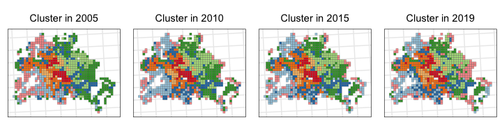
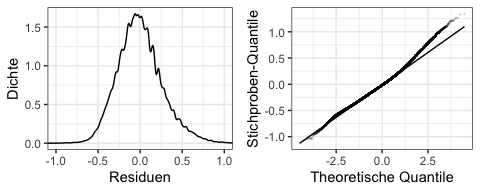

auswertung.Rmd
================
2023-12-28

# Libraries

``` r
# Für Korrelationsmatrizen
library(Hmisc)

# Für Übersichts-Plots
#library(GGally)

# Für schönere Latex-Tabellen
library(stargazer)
library(kableExtra)
library(vtable)

# Für heteroscedasticity-consistent tests
library(sandwich)
library(lmtest)

# Für schönere Plots
library(ggpubr)
library(ggrepel)

# Für schnelleres Einlesen von Daten
library(vroom)

# Für allgemeine Datenmanipulation und Plotten
library(tidyverse)

# Für tidy Regressionsergebnisse
library(broom)

# Fürs Arbeiten mit Geodaten
library(sf)
```

# Importieren der Daten

Die Daten wurden im Dokument ‘cleaning.Rmd’ aufbereitet und
abgespeichert.

``` r
data_rent <- vroom("./daten/data_rent.csv")
data_social <- vroom("./daten/data_social.csv")

inspire_grid_berlin <- st_read("./daten/inspire_grid_berlin.gpkg")
```

    ## Reading layer `inspire_grid_berlin' from data source 
    ##   `/Users/sebastiangeis/Library/CloudStorage/OneDrive-Persönlich/Dokumente/01_Uni/24_Projekt Immobilienmarkt/immoprojekt/daten/inspire_grid_berlin.gpkg' 
    ##   using driver `GPKG'
    ## Simple feature collection with 1016 features and 17 fields
    ## Geometry type: POLYGON
    ## Dimension:     XY
    ## Bounding box:  xmin: 4531000 ymin: 3253000 xmax: 4577000 ymax: 3291000
    ## Projected CRS: ETRS89-extended / LAEA Europe

``` r
bezirksgrenzen_berlin <- st_read("./daten/bezirksgrenzen_berlin/bezirksgrenzen.shp") %>%
  st_transform("EPSG:3035")
```

    ## Reading layer `bezirksgrenzen' from data source 
    ##   `/Users/sebastiangeis/Library/CloudStorage/OneDrive-Persönlich/Dokumente/01_Uni/24_Projekt Immobilienmarkt/immoprojekt/daten/bezirksgrenzen_berlin/bezirksgrenzen.shp' 
    ##   using driver `ESRI Shapefile'
    ## Simple feature collection with 12 features and 6 fields
    ## Geometry type: MULTIPOLYGON
    ## Dimension:     XY
    ## Bounding box:  xmin: 13.08835 ymin: 52.33825 xmax: 13.76116 ymax: 52.67551
    ## Geodetic CRS:  WGS 84

# Summary Statistics

Überblick über die beiden Datensätze mit Anzahl an Beobachtungen,
Mittelwert, Median, Quartilen und mehr.

``` r
data_social %>% select(-jahr, -r1_id) %>%
  mutate(kaufkraft_pro_haushalt_1000 = kaufkraft_pro_haushalt / 1000,
         anzahl_haushalte_1000 = anzahl_haushalte / 1000) %>%
  select(-kaufkraft_pro_haushalt, -anzahl_haushalte) %>%
  pivot_longer(cols = everything()) %>%
  group_by(name) %>%
  drop_na() %>%
  summarise(n = n(), 
            mean = mean(value),
            Std.Dev. = sd(value),
            min = min(value),
            Pctl.25 = quantile(value, probs = 0.25),
            Pctl.50 = quantile(value, probs = 0.5),
            Pctl.75 = quantile(value, probs = 0.75),
            max = max(value)) %>%
  kbl(
    format = "latex",
    digits = 2,
    booktabs = T,
    toprule = "\\hline \\hline",
    midrule = "\\hline",
    bottomrule = "\\hline \\hline",
    linesep = c("", "", "", "", "\\addlinespace"),
  ) %>%
  cat()
```

    ## 
    ## \begin{tabular}[t]{lrrrrrrrr}
    ## \hline \hline
    ## name & n & mean & Std.Dev. & min & Pctl.25 & Pctl.50 & Pctl.75 & max\\
    ## \hline
    ## anteil\_60\_plus & 11205 & 28.00 & 6.81 & 7.77 & 23.66 & 28.54 & 32.75 & 100.00\\
    ## anteil\_auslaender & 11205 & 10.09 & 10.18 & 0.00 & 3.31 & 6.10 & 13.38 & 74.83\\
    ## anteil\_efh & 11205 & 36.82 & 31.47 & 0.00 & 6.23 & 30.81 & 63.16 & 100.00\\
    ## anteil\_mfh & 11205 & 26.81 & 17.94 & 0.00 & 12.24 & 25.27 & 39.00 & 100.00\\
    ## anteil\_oberklassewagen & 9319 & 5.25 & 2.49 & 0.00 & 3.56 & 4.80 & 6.38 & 26.26\\
    ## \addlinespace
    ## anteil\_wohnblock & 11205 & 32.67 & 30.83 & 0.00 & 2.98 & 24.91 & 57.93 & 100.00\\
    ## anzahl\_haushalte\_1000 & 10487 & 2.24 & 2.57 & 0.00 & 0.41 & 1.30 & 3.16 & 14.69\\
    ## arbeitslosenquote & 11205 & 8.54 & 5.14 & 0.00 & 4.49 & 8.15 & 11.95 & 26.58\\
    ## kaufkraft\_pro\_haushalt\_1000 & 10452 & 40.10 & 8.69 & 18.74 & 33.64 & 38.95 & 45.70 & 79.85\\
    ## kreditrisiko & 11205 & 0.60 & 0.20 & 0.11 & 0.43 & 0.59 & 0.78 & 1.00\\
    ## \hline \hline
    ## \end{tabular}

``` r
data_rent %>% select(-jahr, -r1_id) %>%
  pivot_longer(cols = everything()) %>%
  group_by(name) %>%
  drop_na() %>%
  summarise(n = n(), 
            mean = mean(value),
            Std.Dev. = sd(value),
            min = min(value),
            Pctl.25 = quantile(value, probs = 0.25),
            Pctl.50 = quantile(value, probs = 0.5),
            Pctl.75 = quantile(value, probs = 0.75),
            max = max(value)) %>%
  kbl(
    format = "latex",
    digits = 2,
    booktabs = T,
    toprule = "\\hline \\hline",
    midrule = "\\hline",
    bottomrule = "\\hline \\hline",
    linesep = "",
  ) %>%
  cat()
```

    ## 
    ## \begin{tabular}[t]{lrrrrrrrr}
    ## \hline \hline
    ## name & n & mean & Std.Dev. & min & Pctl.25 & Pctl.50 & Pctl.75 & max\\
    ## \hline
    ## mietekalt & 1917043 & 627.08 & 516.80 & 0.01 & 346.00 & 467.86 & 706.54 & 15000\\
    ## mietekalt\_m2 & 1917043 & 8.50 & 115.04 & 0.00 & 5.59 & 7.00 & 9.45 & 58000\\
    ## wohnflaeche & 1917043 & 75.81 & 35.59 & 0.01 & 54.99 & 68.89 & 88.00 & 1000\\
    ## \hline \hline
    ## \end{tabular}

Korrelation zwischen Variablen

``` r
mcor_social <- data_social %>%
  select_if(is.numeric) %>%
  select(-jahr) %>%
  as.matrix() %>%
  Hmisc::rcorr() %>%
  .$r
mcor_social[upper.tri(mcor_social)] <- NA

mcor_social %>%
  data.frame() %>%
  round(2) %>%
  kbl(
    format = "latex",
    digits = 2,
    booktabs = T,
    toprule = "\\hline \\hline",
    midrule = "\\hline",
    bottomrule = "\\hline \\hline",
    linesep = "",
  ) %>%
  cat()
```

    ## 
    ## \begin{tabular}[t]{lrrrrrrrrrr}
    ## \hline \hline
    ##   & anzahl\_haushalte & arbeitslosenquote & anteil\_oberklassewagen & kaufkraft\_pro\_haushalt & anteil\_efh & anteil\_mfh & anteil\_wohnblock & anteil\_auslaender & kreditrisiko & anteil\_60\_plus\\
    ## \hline
    ## anzahl\_haushalte & 1.00 & NA & NA & NA & NA & NA & NA & NA & NA & NA\\
    ## arbeitslosenquote & 0.40 & 1.00 & NA & NA & NA & NA & NA & NA & NA & NA\\
    ## anteil\_oberklassewagen & -0.02 & -0.16 & 1.00 & NA & NA & NA & NA & NA & NA & NA\\
    ## kaufkraft\_pro\_haushalt & -0.33 & -0.71 & 0.19 & 1.00 & NA & NA & NA & NA & NA & NA\\
    ## anteil\_efh & -0.63 & -0.50 & -0.01 & 0.42 & 1.00 & NA & NA & NA & NA & NA\\
    ## anteil\_mfh & -0.20 & -0.08 & 0.03 & 0.07 & -0.31 & 1.00 & NA & NA & NA & NA\\
    ## anteil\_wohnblock & 0.74 & 0.56 & -0.04 & -0.44 & -0.81 & -0.22 & 1.00 & NA & NA & NA\\
    ## anteil\_auslaender & 0.40 & 0.12 & 0.06 & -0.10 & -0.37 & -0.10 & 0.43 & 1.00 & NA & NA\\
    ## kreditrisiko & 0.56 & 0.59 & -0.15 & -0.52 & -0.68 & -0.04 & 0.70 & 0.45 & 1.00 & NA\\
    ## anteil\_60\_plus & -0.44 & -0.48 & 0.18 & 0.39 & 0.30 & 0.28 & -0.46 & -0.23 & -0.46 & 1\\
    ## \hline \hline
    ## \end{tabular}

Die größte Korrelation liegt zwischen dem Anteil an Wohnblocks und der
Anzahl der Haushalte vor. Das ist soweit nicht überraschend. Als
nächstes folgt mit einem Korrelationskoeffizienten von 0.7 der
Zusammenhang zwischen dem Kreditrisiko und dem Anteil an Wohnblocks.

# Plotting

## Berlin Karte

Der INSPIRE Grid mit den Berliner Bezirken

``` r
ggplot()+
  geom_sf(data = inspire_grid_berlin)+
  geom_sf(data = bezirksgrenzen_berlin, fill = "white", alpha = .8, color = "black")+
  ggrepel::geom_label_repel(data = bezirksgrenzen_berlin %>% mutate(Gemeinde_n = str_replace(Gemeinde_n, "-", "-\n")), 
                           aes(label = Gemeinde_n, geometry = geometry),
                           stat = "sf_coordinates",
                           min.segment.length = 0.2, 
                           force_pull = 50,
                           box.padding = 0.1,
                           label.padding = .1,
                           size = 2,
                           label.r = 0,
                           lineheight = 1,
                           fill = "white")+
  coord_sf(crs = 3035)+
  #geom_sf_text(data = bezirksgrenzen_berlin %>% mutate(Gemeinde_n = str_replace(Gemeinde_n, "-", "-\n")), aes(label = Gemeinde_n), size = 3)+
  theme_bw()
```

<!-- -->

``` r
ggsave("./plots/plot_berlin_karte.png")
```

    ## Saving 5 x 3 in image

Der hier gezeigt Teil des Grids hat 1016 Quadrate, also eine Fläche von
1016km². Berlin hat genaugenommen nur eine Fläche von 891,8 km², wir
betrachten also auch teilweise Flächen, die eigentlich nicht mehr zu
Berlin gehören, da wir alle Quadrate einbeziehen, die (auch nur
teilweise) mit den Stadtgrenzen überlappen. Die andere Möglichkeit wäre
gewesen, die Fläche zu unterschätzen und nur Quadrate zu betrachten, die
komplett innerhalb der Stadtgrenzen liegen.

## Rent Daten

Wie hat sich die Verteilung der Kaltmieten über die Jahre geändert?

``` r
plot1 <- data_rent %>%
  filter(jahr %in% 2010:2020) %>%
  mutate(mietekalt_m2 = mietekalt / wohnflaeche) %>%
  filter(mietekalt_m2 > 0, mietekalt_m2 < 100) %>%
  ggplot(aes(x = jahr, y = mietekalt_m2, group = jahr))+
  geom_boxplot(outlier.shape = NA)+
  coord_cartesian(ylim = c(0, 30))+
  scale_x_continuous(breaks = 2010:2020, labels = 10:20)+
  theme_bw()+
  labs(x = "Jahr", y = "Kaltmiete pro m²")

plot2 <- data_rent %>%
  filter(jahr == 2010) %>%
  filter(mietekalt > 50, mietekalt < 10000) %>%
  ggplot(aes(x = mietekalt, y = after_stat(density))) +
  geom_histogram(binwidth = 20) +
  geom_vline(aes(xintercept = mean(mietekalt), color = "Mean"), linewidth = .8, linetype = "dashed") +
  geom_vline(aes(xintercept = median(mietekalt), color = "Median"), linewidth = .8, linetype = "dashed") +
  scale_color_manual("Statistics", values = c("Mean" = "red", "Median" = "blue"))+
  coord_cartesian(xlim = c(0, 2000)) +
  scale_y_continuous(labels = scales::percent_format(accuracy = .1))+
  theme_bw() +
  theme(legend.position = c(0.8, 0.8), legend.title = element_blank(), legend.background = element_blank())+
  labs(x = "Kaltmiete 2010", y = "Dichte in %")

plot3 <- data_rent %>%
  filter(jahr == 2020) %>%
  filter(mietekalt > 50, mietekalt < 10000) %>%
  ggplot(aes(x = mietekalt, y = after_stat(density))) +
  geom_histogram(binwidth = 20) +
  geom_vline(aes(xintercept = mean(mietekalt), color = "Mean"), linewidth = .8, linetype = "dashed") +
  geom_vline(aes(xintercept = median(mietekalt), color = "Median"), linewidth = .8, linetype = "dashed") +
  scale_color_manual("Statistics", values = c("Mean" = "red", "Median" = "blue"))+
  coord_cartesian(xlim = c(0, 2000)) +
  scale_y_continuous(labels = scales::percent_format(accuracy = .1))+
  theme_bw() +
  theme(legend.position = c(0.8, 0.8), legend.title = element_blank(), legend.background = element_blank())+
  labs(x = "Kaltmiete 2020", y = "Dichte in %")

ggarrange(plot1,
          ggarrange(plot2, plot3, nrow = 2),
          nrow = 1)
```

<!-- -->

``` r
ggsave("./plots/plot_miete.png")
```

    ## Saving 7.5 x 4.5 in image

Mittlere Kaltmiete auf Karte

``` r
data_rent_sf <- data_rent %>%
  left_join(inspire_grid_berlin %>% select(r1_id, geom), by = "r1_id") %>%
  st_as_sf()

data_rent_sf_plot <- data_rent_sf %>%
  filter(jahr == 2015) %>%
  group_by(r1_id) %>%
  summarise(mietekalt = mean(mietekalt),
            wohnflaeche = mean(wohnflaeche),
            mietekalt_m2 = mean(mietekalt_m2))

plot1 <- data_rent_sf_plot %>%
  filter(mietekalt > quantile(mietekalt, probs = 0.01), mietekalt < quantile(mietekalt, probs = 0.99)) %>%
  ggplot()+
  geom_sf(aes(fill = mietekalt))+
  scale_fill_viridis_c(trans = "log10", breaks = c(400, 600, 900, 1300))+
  theme_bw()+
  theme(legend.position = "top",
        axis.ticks = element_blank(),
        axis.text = element_blank(),
        plot.subtitle = element_text(hjust = .5),
        legend.margin = margin(t = 0, b = -5, l = 0, r = 0))+
  labs(fill = element_blank(),
       subtitle = "Kaltmiete (€)")

plot2 <- data_rent_sf_plot %>%
  filter(wohnflaeche > quantile(wohnflaeche, probs = 0.01), wohnflaeche < quantile(wohnflaeche, probs = 0.99)) %>%
  ggplot()+
  geom_sf(aes(fill = wohnflaeche))+
  scale_fill_viridis_c(trans = "log10", breaks = c(50, 70, 100, 130))+
  theme_bw()+
  theme(legend.position = "top",
        axis.ticks = element_blank(),
        axis.text = element_blank(),
        plot.subtitle = element_text(hjust = .5),
        legend.margin = margin(t = 0, b = -5, l = 0, r = 0))+
  labs(fill = element_blank(),
       subtitle = "Wohnfläche (m²)")

plot3 <- data_rent_sf_plot %>%
  filter(mietekalt_m2 > quantile(mietekalt_m2, probs = 0.01), mietekalt_m2 < quantile(mietekalt_m2, probs = 0.99)) %>%
  ggplot()+
  geom_sf(aes(fill = mietekalt_m2))+
  scale_fill_viridis_c(trans = "log10", breaks = c(6, 8, 10, 12, 14))+
  theme_bw()+
  theme(legend.position = "top",
        axis.ticks = element_blank(),
        axis.text = element_blank(),
        plot.subtitle = element_text(hjust = .5),
        legend.margin = margin(t = 0, b = -5, l = 0, r = 0))+
  labs(fill = element_blank(),
       subtitle = "Kaltmiete (€/m²)")

ggarrange(plot1, plot2, plot3, nrow = 1)
```

<!-- -->

``` r
#rm(data_rent_sf_plot)

ggsave("./plots/plot_miete_karte_2015.png", width = 7.5, height = 2.5)
```

## Social Daten

Wie sehen ausgewählte Social-Variablen auf einer Karte aus?

``` r
# arbeitslosenquote, kaufkraft_pro_haushalt, anteil_60_plus, anteil_auslaender

data_social_sf <- data_social %>%
  left_join(inspire_grid_berlin %>% select(r1_id, geom), by = "r1_id") %>%
  st_as_sf()
  
plot1 <- data_social_sf %>%
  filter(jahr == 2015) %>%
  ggplot(aes(fill = arbeitslosenquote, geometry = geom), linewidth = .1)+
  geom_sf()+
  scale_fill_viridis_c()+
  labs(subtitle = "Arbeitslosenquote",
       fill = element_blank())+
  theme_bw()+
  theme(legend.position = "top",
        axis.text = element_blank(),
        axis.ticks = element_blank(),
        plot.subtitle=element_text(hjust=0.5),
        legend.margin = margin(t = 0, b = -5, l = 0, r = 0))

plot2 <- data_social_sf %>%
  filter(jahr == 2015) %>%
  ggplot(aes(fill = kaufkraft_pro_haushalt, geometry = geom), linewidth = .1)+
  geom_sf()+
  scale_fill_viridis_c(trans = "log10", breaks = c(30000, 50000, 70000))+
  labs(subtitle = "Kaufkraft",
       fill = element_blank())+
  theme_bw()+
  theme(legend.position = "top",
        axis.text = element_blank(),
        axis.ticks = element_blank(),
        plot.subtitle=element_text(hjust=0.5),
        legend.margin = margin(t = 0, b = -5, l = 0, r = 0))

plot3 <- data_social_sf %>%
  filter(jahr == 2015) %>%
  filter(anteil_60_plus < 80) %>%
  ggplot(aes(fill = anteil_60_plus, geometry = geom), linewidth = .1)+
  geom_sf()+
  scale_fill_viridis_c()+
  labs(subtitle = "Anteil 60+",
       fill = element_blank())+
  theme_bw()+
  theme(legend.position = "top",
        axis.text = element_blank(),
        axis.ticks = element_blank(),
        plot.subtitle=element_text(hjust=0.5),
        legend.margin = margin(t = 0, b = -5, l = 0, r = 0))

plot4 <- data_social_sf %>%
  filter(jahr == 2015) %>%
  ggplot(aes(fill = anteil_auslaender, geometry = geom), linewidth = .1)+
  geom_sf()+
  scale_fill_viridis_c()+
  labs(subtitle = "Ausländeranteil",
       fill = element_blank())+
  theme_bw()+
  theme(legend.position = "top",
        axis.text = element_blank(),
        axis.ticks = element_blank(),
        plot.subtitle=element_text(hjust=0.5),
        legend.margin = margin(t = 0, b = -5, l = 0, r = 0))

ggarrange(plot1, plot2, plot3, plot4, nrow = 1)
```

<!-- -->

``` r
ggsave("./plots/plot_data_social_2015.png")
```

    ## Saving 7.5 x 2.5 in image

# Clustering

k-means clustering mit den Variablen

- arbeitslosenquote
- kaufkraft_pro_haushalt
- anteil_auslaender
- anteil_efh
- anteil_60_plus

Es werden 4 Cluster verwendet. *Hier Begründung einfügen*

``` r
data_clustering <- data_social %>%
  filter(jahr == 2015) %>%
  drop_na() %>%
  select(anzahl_haushalte, arbeitslosenquote, kaufkraft_pro_haushalt, anteil_auslaender, anteil_efh, anteil_60_plus) %>%
  as.matrix() %>%
  scale()

set.seed(1)
kmeans_result_2015 <- kmeans(data_clustering, centers = 4)

data_social %>%
  filter(jahr == 2015) %>%
  drop_na() %>%
  cbind(cluster = kmeans_result_2015$cluster) %>%
  mutate(cluster = as_factor(cluster)) %>%
  left_join(inspire_grid_berlin %>% select(r1_id), by = "r1_id") %>%
  st_as_sf() %>%
  ggplot()+
  geom_sf(aes(fill = cluster))+
  theme_bw()
```

<!-- -->

``` r
ggsave("./plots/plot_cluster_2015.png")
```

    ## Saving 5 x 3 in image

Cluster sind sehr ähnlich zu den Wahlergebnissen der Bundestagswahl in
Berlin 2016 

Wer steckt hinter den Clustern? Um diese Frage zu beantworten können wir
die Mittelwerte der jeweiligen Cluster betrachten.

``` r
kmeans_result_2015$centers %>% t() %>% round(2)
```

    ##                            1     2     3     4
    ## anzahl_haushalte       -0.63  0.29 -0.53  2.12
    ## arbeitslosenquote      -0.06  0.80 -1.02  0.79
    ## kaufkraft_pro_haushalt -0.28 -0.62  1.02 -0.67
    ## anteil_auslaender      -0.52  0.13 -0.42  2.10
    ## anteil_efh              1.03 -0.83  0.52 -1.11
    ## anteil_60_plus         -0.12 -0.21  0.72 -1.43

``` r
kmeans_result_2015$centers %>% t() %>% round(2) %>%
  kbl(
    format = "latex",
    digits = 2,
    booktabs = T,
    toprule = "\\hline \\hline",
    midrule = "\\hline",
    bottomrule = "\\hline \\hline",
    linesep = "",
  ) %>% cat()
```

    ## 
    ## \begin{tabular}[t]{lrrrr}
    ## \hline \hline
    ##   & 1 & 2 & 3 & 4\\
    ## \hline
    ## anzahl\_haushalte & -0.63 & 0.29 & -0.53 & 2.12\\
    ## arbeitslosenquote & -0.06 & 0.80 & -1.02 & 0.79\\
    ## kaufkraft\_pro\_haushalt & -0.28 & -0.62 & 1.02 & -0.67\\
    ## anteil\_auslaender & -0.52 & 0.13 & -0.42 & 2.10\\
    ## anteil\_efh & 1.03 & -0.83 & 0.52 & -1.11\\
    ## anteil\_60\_plus & -0.12 & -0.21 & 0.72 & -1.43\\
    ## \hline \hline
    ## \end{tabular}

Die Werte können nicht direkt interpretiert werden, da sie vorher durch
`scale()` mittelwertbereinigt und varianzbereinigt wurden. Was aber
interpretiert werden kann ist der Unterschied zwischen den Werten.

Betrachten wir beispielsweise Cluster 3:

- Die Anzahl der Haushalte ist am geringsten, das heißt pro
  Quadratkilometer wohnen hier weniger Menschen als in den anderen
  Teilen Berlins.
- Die Arbeitslosenquote ist ebenfalls am kleinsten.
- Die Kaufkraft pro Haushalt ist dagegen im Vergleich am größten, es
  handelt sich also um eine wohlhabende Gegend.
- Der Anteil an Ausländern ist vergleichsweise klein, jedoch größer als
  in Cluster 1.
- Die Anzahl der Einfamilienhäuser ist im Vergleich groß, aber kleiner
  als in Cluster 1.
- Der Anteil der Bevölkerung über 60 Jahre ist ebenso mit Abstand am
  größten.

Anhand dieser Werte bzw. dem Vergleich zwischen den Werten haben wir
eine zusammenfassende Beschreibung für die 4 Gebiete erstellt:

- Cluster 1: Multikulturelle Ballungsräume
- Cluster 2: Stabile Wohngebiete
- Cluster 3: Wohlhabende Seniorengemeinschaften
- Cluster 4: Sozial herausgeforderte Viertel

## Zeitliche Stabilität der Cluster

Sind die Cluster über die Zeit stabil? Das ist wichtig falls wir
Regressionen basierend auf diesen Clusterungen vornehmen.

``` r
# Split data by year
data_clustering_year <- data_social %>%
  select(jahr, anzahl_haushalte, arbeitslosenquote, kaufkraft_pro_haushalt, anteil_auslaender, anteil_efh, anteil_60_plus) %>%
  drop_na() %>%
  group_by(jahr) %>%
  filter(jahr %in% c(2005, 2010, 2015, 2019)) %>%
  group_split(.keep = FALSE)

kmeans_result_2005 <- data_clustering_year[[1]] %>% as.matrix() %>% scale() %>%
  kmeans(., centers = 4)
#kmeans_result_2005

kmeans_result_2010 <- data_clustering_year[[2]] %>% as.matrix() %>% scale() %>%
  kmeans(., centers = 4)
#kmeans_result_2010

kmeans_result_2015 <- data_clustering_year[[3]] %>% as.matrix() %>% scale() %>%
  kmeans(., centers = 4)
#kmeans_result_2015

kmeans_result_2019 <- data_clustering_year[[4]] %>% as.matrix() %>% scale() %>%
  kmeans(., centers = 4)
#kmeans_result_2019
```

``` r
plot1 <- data_social_sf %>%
  filter(jahr == 2005) %>%
  select(r1_id, jahr, anzahl_haushalte, arbeitslosenquote, kaufkraft_pro_haushalt, anteil_auslaender, anteil_efh, anteil_60_plus) %>%
  drop_na() %>%
  cbind(cluster = kmeans_result_2005$cluster) %>%
  mutate(cluster = as_factor(cluster)) %>%
  ggplot()+
  geom_sf(aes(fill = cluster), linewidth = .1)+
  labs(subtitle = "Cluster in 2005")+
  theme_bw()+
  theme(legend.position = "none",
        axis.text = element_blank(),
        axis.ticks = element_blank(),
        plot.subtitle = element_text(hjust = .5))

plot2 <- data_social_sf %>%
  filter(jahr == 2010) %>%
  select(r1_id, jahr, anzahl_haushalte, arbeitslosenquote, kaufkraft_pro_haushalt, anteil_auslaender, anteil_efh, anteil_60_plus) %>%
  drop_na() %>%
  cbind(cluster = kmeans_result_2010$cluster) %>%
  mutate(cluster = as_factor(cluster)) %>%
  ggplot()+
  geom_sf(aes(fill = cluster), linewidth = .1)+
  labs(subtitle = "Cluster in 2010")+
  theme_bw()+
  theme(legend.position = "none",
        axis.text = element_blank(),
        axis.ticks = element_blank(),
        plot.subtitle = element_text(hjust = .5))

plot3 <- data_social_sf %>%
  filter(jahr == 2015) %>%
  select(r1_id, jahr, anzahl_haushalte, arbeitslosenquote, kaufkraft_pro_haushalt, anteil_auslaender, anteil_efh, anteil_60_plus) %>%
  drop_na() %>%
  cbind(cluster = kmeans_result_2015$cluster) %>%
  mutate(cluster = as_factor(cluster)) %>%
  ggplot()+
  geom_sf(aes(fill = cluster), linewidth = .1)+
  labs(subtitle = "Cluster in 2015")+
  theme_bw()+
  theme(legend.position = "none",
        axis.text = element_blank(),
        axis.ticks = element_blank(),
        plot.subtitle = element_text(hjust = .5))

plot4 <- data_social_sf %>%
  filter(jahr == 2019) %>%
  select(r1_id, jahr, anzahl_haushalte, arbeitslosenquote, kaufkraft_pro_haushalt, anteil_auslaender, anteil_efh, anteil_60_plus) %>%
  drop_na() %>%
  cbind(cluster = kmeans_result_2019$cluster) %>%
  mutate(cluster = as_factor(cluster)) %>%
  ggplot()+
  geom_sf(aes(fill = cluster), linewidth = .1)+
  labs(subtitle = "Cluster in 2019")+
  theme_bw()+
  theme(legend.position = "none",
        axis.text = element_blank(),
        axis.ticks = element_blank(),
        plot.subtitle = element_text(hjust = .5))

ggarrange(plot1, plot2, plot3, plot4, nrow = 1)
```

<!-- -->

``` r
ggsave("./plots/plot_cluster_jahr_vergleich.png")
```

    ## Saving 7.5 x 2.5 in image

**TODO:** Clusterfarben konsistent machen

**Ergebnis:** Die Cluster sind über die Zeit ziemlich stabil. Erst in
2019 lassen sich einige größere Unterschiede bzw. Abweichungen erkennen.
Wichtig ist, dass die Farbe der Cluster zwischen den Jahren nicht
konstant ist. Es sollte also die Form der Cluster über die Jahre
betrachtet werden. Statt 2020 wurde 2019 verwendet, da dies das letzte
Jahr aus dem Datensatz ist.

# Regressionen

## Miete über die Jahre

Wie hat sich die Miete im Laufe der Jahre geändert?

Um diese Frage zu beantworten schätzen wir das folgende
Regressionsmodell:
$\ln(\text{Kaltmiete pro Quadratmeter}_i) = \beta_0 + \beta_1 \cdot \text{jahr}_i + \epsilon_i$.
Wir benutzen den Logarithmus, um um näher an eine Normalverteilung der
Residuen (siehe unten) heranzukommen. Nur das erlaubt die Anwendung
eines t-Tests zur Bestimmung der statistischen Signifikanz.

``` r
# Regression Miete

lm_miete_jahr <- data_rent %>%
  mutate(mietekalt_m2 = mietekalt / wohnflaeche) %>%
  filter(!is.na(mietekalt_m2)) %>%
  filter(mietekalt_m2 < quantile(mietekalt_m2, 0.99), mietekalt_m2 > quantile(mietekalt_m2, 0.01)) %>%
  mutate(jahr = jahr - 2007) %>%
  lm(log(mietekalt_m2) ~ jahr, data = .)

summary(lm_miete_jahr)
```

    ## 
    ## Call:
    ## lm(formula = log(mietekalt_m2) ~ jahr, data = .)
    ## 
    ## Residuals:
    ##      Min       1Q   Median       3Q      Max 
    ## -1.23238 -0.18946 -0.02226  0.17420  1.42667 
    ## 
    ## Coefficients:
    ##              Estimate Std. Error t value Pr(>|t|)    
    ## (Intercept) 1.701e+00  3.306e-04    5146   <2e-16 ***
    ## jahr        5.998e-02  5.206e-05    1152   <2e-16 ***
    ## ---
    ## Signif. codes:  0 '***' 0.001 '**' 0.01 '*' 0.05 '.' 0.1 ' ' 1
    ## 
    ## Residual standard error: 0.2785 on 1878607 degrees of freedom
    ## Multiple R-squared:  0.4141, Adjusted R-squared:  0.4141 
    ## F-statistic: 1.328e+06 on 1 and 1878607 DF,  p-value: < 2.2e-16

Das Ergebnis der Regression spiegelt das wieder, was bereits im Boxplot
oben gezeigt wurde: Die Miete steigt im Durchschnitt pro Jahr. Konkret
wissen wir nun, dass die Miete pro Jahr im Schnitt um
$\exp(0.06015)-1=6.1\%$ steigt. Der Wert des $\beta_0$ (Intercept) lässt
sich interpretieren, wenn er zurücktransformiert wird. Das Jahr Null
wurde auf 2007 gesetzt, so ergibt sich die Konstante, also die
Mietbelastung im Jahr 2007, zu $\exp(1.701) = 5.48$. Interessant ist für
uns noch der Wert der t-Statistik beziehungsweise der p-Wert. Dieser ist
nahe 0 und zeigt somit starke statistische Signifikanz. Dies impliziert,
dass die Wahrscheinlichkeit, dass der ermittelte Zusammenhang lediglich
auf Zufall beruht, äußerst gering ist. Das ist durch die schiere Größe
des Datensatzes (knapp 1.9 Mio. Beobachtungen) jedoch nicht weiter
überraschend. Umso wichtiger ist es hingegen, auch auf die ökonomische
Relevanz des Zusammenhangs zu achten. Eine Steigerung von knapp 6% pro
Jahr ist jedoch auch ökonomisch relevant, liegt diese doch weit über dem
zu dieser Zeit vorherrschenden allgemeinen Inflationsniveau von unter
2%.

``` r
# Regression Mietbelastung

lm_mietbelastung_jahr <- data_social %>%
  filter(jahr == 2015) %>%
  filter(!is.na(arbeitslosenquote), !is.na(kaufkraft_pro_haushalt)) %>%
  mutate(ist_brennpunkt = ifelse(arbeitslosenquote > 10 & kaufkraft_pro_haushalt < quantile(kaufkraft_pro_haushalt, .2), TRUE, FALSE)) %>%
  select(r1_id, ist_brennpunkt, kaufkraft_pro_haushalt) %>%
  right_join(data_rent, by = "r1_id") %>%
  filter(!is.na(ist_brennpunkt)) %>%
  mutate(mietbelastung = mietekalt*12 / kaufkraft_pro_haushalt) %>%
  filter(!is.na(mietekalt_m2)) %>%
  filter(mietekalt_m2 < quantile(mietekalt_m2, 0.99), mietekalt_m2 > quantile(mietekalt_m2, 0.01)) %>%
  mutate(jahr = jahr - 2007) %>%
  lm(mietbelastung ~ jahr, data = .)

summary(lm_mietbelastung_jahr)
```

    ## 
    ## Call:
    ## lm(formula = mietbelastung ~ jahr, data = .)
    ## 
    ## Residuals:
    ##     Min      1Q  Median      3Q     Max 
    ## -0.2951 -0.0761 -0.0359  0.0268  4.1972 
    ## 
    ## Coefficients:
    ##              Estimate Std. Error t value Pr(>|t|)    
    ## (Intercept) 1.391e-01  1.758e-04   791.3   <2e-16 ***
    ## jahr        1.305e-02  2.768e-05   471.3   <2e-16 ***
    ## ---
    ## Signif. codes:  0 '***' 0.001 '**' 0.01 '*' 0.05 '.' 0.1 ' ' 1
    ## 
    ## Residual standard error: 0.1481 on 1878428 degrees of freedom
    ## Multiple R-squared:  0.1058, Adjusted R-squared:  0.1058 
    ## F-statistic: 2.222e+05 on 1 and 1878428 DF,  p-value: < 2.2e-16

Betrachtet man die Regression zur Mietbelastung, so erkennt man, dass
auch diese über die Zeit angestiegen ist. Die abhängige Variable wurde
in diesem Modell nicht log-transformiert, wodurch sich die Koeffizienten
der Regression direkt interpretieren lassen. Die Konstante zeigt, dass
die Mietbelastung im Jahr 2007 bei knapp 14% liegt. Pro Jahr steigt
dieser Wert dann im Durchschnitt um 1.3pp. Sowohl die Konstante als auch
der Effekt pro Jahr sind statistisch signifikant.

``` r
# Stargazer Tabelle

stargazer(lm_miete_jahr, lm_mietbelastung_jahr, 
          dep.var.labels = c("log Kaltmiete (€/m\\textsuperscript{2})", "Mietbelastung (\\%)"), 
          covariate.labels = c("Jahr", "Konstante"),
          omit.stat = c("ser", "f"), single.row = FALSE, 
          no.space = TRUE,
          dep.var.caption = "\\textit{Abhängige Variable}",
          notes.label = "\\textit{Anmerkung:}")
```

    ## 
    ## % Table created by stargazer v.5.2.3 by Marek Hlavac, Social Policy Institute. E-mail: marek.hlavac at gmail.com
    ## % Date and time: Fri, Jan 19, 2024 - 18:35:20
    ## \begin{table}[!htbp] \centering 
    ##   \caption{} 
    ##   \label{} 
    ## \begin{tabular}{@{\extracolsep{5pt}}lcc} 
    ## \\[-1.8ex]\hline 
    ## \hline \\[-1.8ex] 
    ##  & \multicolumn{2}{c}{\textit{Abhängige Variable}} \\ 
    ## \cline{2-3} 
    ## \\[-1.8ex] & log Kaltmiete (€/m\textsuperscript{2}) & Mietbelastung (\%) \\ 
    ## \\[-1.8ex] & (1) & (2)\\ 
    ## \hline \\[-1.8ex] 
    ##  Jahr & 0.060$^{***}$ & 0.013$^{***}$ \\ 
    ##   & (0.0001) & (0.00003) \\ 
    ##   Konstante & 1.701$^{***}$ & 0.139$^{***}$ \\ 
    ##   & (0.0003) & (0.0002) \\ 
    ##  \hline \\[-1.8ex] 
    ## Observations & 1,878,609 & 1,878,430 \\ 
    ## R$^{2}$ & 0.414 & 0.106 \\ 
    ## Adjusted R$^{2}$ & 0.414 & 0.106 \\ 
    ## \hline 
    ## \hline \\[-1.8ex] 
    ## \textit{Anmerkung:} & \multicolumn{2}{r}{$^{*}$p$<$0.1; $^{**}$p$<$0.05; $^{***}$p$<$0.01} \\ 
    ## \end{tabular} 
    ## \end{table}

Zunächst wollen wir noch die Robustheit der Regression überprüfen um
Sicher zu gehen, dass der t-Test überhaupt ein sinnvolles Ergebnis
liefert. Dafür betrachten wir zuerst die Verteilung der Residuen, hier
der Einfachheit als Dichte dargestellt.

``` r
plot1 <- lm_miete_jahr$residuals %>%
  data.frame(resids = .) %>%
  ggplot(aes(x = resids))+
  geom_density()+
  coord_cartesian(xlim = c(-1, 1))+
  theme_bw()+
  labs(x = "Residuen", y = "Dichte")

plot2 <- lm_miete_jahr$residuals %>%
  data.frame(resids = .) %>%
  slice_sample(prop = .1) %>%
  ggplot(aes(sample = resids)) +
  stat_qq(alpha = .1, size = .2) +
  stat_qq_line() +
  xlab("Theoretische Quantile") +
  ylab("Stichproben-Quantile")+
  theme_bw()
  
ggarrange(plot1, plot2, nrow = 1)
```

<!-- -->

``` r
ggsave("./plots/plot_regression_miete_jahr.png", width = 5, height = 2)
```

Im Ergebnis sehen wir eine ziemlich gute Normalverteilung. Links ist die
Dichtefunktion der Residuen zu sehen und rechts ein QQ-Plot. Würden alle
Punkte des QQ-Plots auf der Geraden liegen, so läge eine perfekte
Normalverteilung in der Stichprobe vor. Dies ist hier nicht der Fall, da
an den Rändern, insbesondere am rechten Rand, die Stichproben-Quantile
über der Geraden liegen. Dies deutet auf eine (leicht) rechtsschiefe
Verteilung hin.

``` r
data_rent %>%
  mutate(mietekalt_m2 = mietekalt / wohnflaeche) %>%
  filter(!is.na(mietekalt_m2)) %>%
  filter(mietekalt_m2 < quantile(mietekalt_m2, 0.99), mietekalt_m2 > quantile(mietekalt_m2, 0.01)) %>%
  mutate(mietekalt_m2 = log(mietekalt_m2)) %>%
  group_by(jahr) %>%
  summarise(variance = var(mietekalt_m2)) %>%
  round(2)
```

    ## # A tibble: 15 × 2
    ##     jahr variance
    ##    <dbl>    <dbl>
    ##  1  2007     0.06
    ##  2  2008     0.06
    ##  3  2009     0.06
    ##  4  2010     0.07
    ##  5  2011     0.07
    ##  6  2012     0.08
    ##  7  2013     0.08
    ##  8  2014     0.09
    ##  9  2015     0.08
    ## 10  2016     0.09
    ## 11  2017     0.09
    ## 12  2018     0.09
    ## 13  2019     0.11
    ## 14  2020     0.15
    ## 15  2021     0.15

Ein Problem ist jedoch Heteroskedastizität. So nennt man das Phänomen
von nicht stabilen Varianzen. Für diesen Fall konkret sehen wir, dass
die Varianz über die Jahre steigt, die Preise für Wohnungen streuen also
immer weiter. Mathematisch bringt das Probleme mit der Robustheit der
Schätzung, insbesondere kann dies zu Verzerrungne in den Standardfehlern
führen. Diese werden wiederum für den t-Test und die Bestimmung der
statistischen Signifikanz benötigt.

Um dieses Problem zu umgehen, berechnen wir im folgenden robuste
Standardfehler und Vergleichen die Ergebnisse mit der ursprünglichen
Regression. Dafür wird eine “heteroskedasticity-consistent” (HC)
Kovarianzmatrix geschätzt.

``` r
coeftest_lm_miete_jahr <- coeftest(lm_miete_jahr, vcov = vcovHC(lm_miete_jahr, type = "HC3"))
coeftest_lm_miete_jahr
```

    ## 
    ## t test of coefficients:
    ## 
    ##               Estimate Std. Error t value  Pr(>|t|)    
    ## (Intercept) 1.7014e+00 3.0887e-04  5508.6 < 2.2e-16 ***
    ## jahr        5.9983e-02 5.7243e-05  1047.9 < 2.2e-16 ***
    ## ---
    ## Signif. codes:  0 '***' 0.001 '**' 0.01 '*' 0.05 '.' 0.1 ' ' 1

``` r
stargazer(coeftest_lm_miete_jahr, 
          dep.var.labels = "log Kaltmiete (€/m\\textsuperscript{2})", 
          covariate.labels = c("Jahr", "Konstante"),
          omit.stat = c("ser", "f"), single.row = FALSE, 
          no.space = TRUE,
          dep.var.caption = "\\textit{Abhängige Variable}",
          notes.label = "\\textit{Anmerkung:}")
```

    ## 
    ## % Table created by stargazer v.5.2.3 by Marek Hlavac, Social Policy Institute. E-mail: marek.hlavac at gmail.com
    ## % Date and time: Fri, Jan 19, 2024 - 18:35:27
    ## \begin{table}[!htbp] \centering 
    ##   \caption{} 
    ##   \label{} 
    ## \begin{tabular}{@{\extracolsep{5pt}}lc} 
    ## \\[-1.8ex]\hline 
    ## \hline \\[-1.8ex] 
    ##  & \multicolumn{1}{c}{\textit{Abhängige Variable}} \\ 
    ## \cline{2-2} 
    ## \\[-1.8ex] & log Kaltmiete (€/m\textsuperscript{2}) \\ 
    ## \hline \\[-1.8ex] 
    ##  Jahr & 0.060$^{***}$ \\ 
    ##   & (0.0001) \\ 
    ##   Konstante & 1.701$^{***}$ \\ 
    ##   & (0.0003) \\ 
    ##  \hline \\[-1.8ex] 
    ## \hline 
    ## \hline \\[-1.8ex] 
    ## \textit{Anmerkung:} & \multicolumn{1}{r}{$^{*}$p$<$0.1; $^{**}$p$<$0.05; $^{***}$p$<$0.01} \\ 
    ## \end{tabular} 
    ## \end{table}

Wenn wir das Ergebnis dieser Schätzung mit dem des ursprünglichen
Modells vergleichen, sehen wir keine Unterschiede bei den Schätzwerten
der Betas. Die Standardfehler hingegen sind etwas größer. Das war zu
erwarten, da durch die vorliegende Heteroskedastizität die
Standardfehler in der ursprünglichen Regression verzerrt waren.
Allerdings ist die Abweichung marginal, was sich auch in einem quasi
unverändert bei fast Null liegendem p-Wert zeigt. Aufgrund dieser
kleinen Abweichung, werden wir in den restlichen Auswertungen keine
gesonderten Tests mehr aufgrund von Heteroskedastizität durchführen,
wenn der p-Wert wie in diesem Fall extrehm nah an Null liegt. Denn
selbst wenn die t-Statistiken leicht verzerrt sind, ändert das nichts an
der Interpretation.

## Miete und Mietbelastung in “Brennpunkten”

Hat sich die Miete in Brennpunkten über die Jahre stärker erhöht?

Hierzu müssen wir neben `data_rent` auch `data_social` verwenden. Wir
definieren einen “Brennpunkt” als eine Gegend, in der die
Arbeitslosenquote 2015 über 10% liegt und wo die Kaufkraft im unteren
20% Quantil liegt.

Als Regressionsmodell verwenden wir
$\log(\text{Kaltmiete}_i) = \beta_0 + \beta_1 \cdot \text{Jahr}_i + \beta_2 \cdot \text{Brennpunkt}_i + \beta_3 \cdot \text{Brennpunkt}_i\cdot \text{Jahr}_i + \epsilon_i$
mit einem Interaktionsterm zwischen dem Jahr und der binären
Ist-Brennpunkt Variable.

**TODO:** Erklären, wieso wir $jahr = jahr - 2007$ rechnen (um den
Effekt von ist_brennpunkt und dem Intercept interpretieren zu können…)

``` r
# Regression Miete

lm_miete_brennpunkt <- data_social %>%
  filter(jahr == 2015) %>%
  filter(!is.na(arbeitslosenquote), !is.na(kaufkraft_pro_haushalt)) %>%
  mutate(ist_brennpunkt = ifelse(arbeitslosenquote > 10 & kaufkraft_pro_haushalt < quantile(kaufkraft_pro_haushalt, .2), TRUE, FALSE)) %>%
  select(r1_id, ist_brennpunkt) %>%
  right_join(data_rent, by = "r1_id") %>%
  filter(!is.na(ist_brennpunkt)) %>%
  mutate(mietekalt_m2 = mietekalt / wohnflaeche) %>%
  filter(!is.na(mietekalt_m2)) %>%
  filter(mietekalt_m2 < quantile(mietekalt_m2, 0.99), mietekalt_m2 > quantile(mietekalt_m2, 0.01)) %>%
  mutate(jahr = jahr - 2007) %>%
  lm(log(mietekalt_m2) ~ jahr + ist_brennpunkt + ist_brennpunkt:jahr, data = .)

summary(lm_miete_brennpunkt)
```

    ## 
    ## Call:
    ## lm(formula = log(mietekalt_m2) ~ jahr + ist_brennpunkt + ist_brennpunkt:jahr, 
    ##     data = .)
    ## 
    ## Residuals:
    ##      Min       1Q   Median       3Q      Max 
    ## -1.23787 -0.18572 -0.01918  0.17350  1.39547 
    ## 
    ## Coefficients:
    ##                           Estimate Std. Error t value Pr(>|t|)    
    ## (Intercept)              1.733e+00  3.946e-04 4391.23   <2e-16 ***
    ## jahr                     5.736e-02  6.147e-05  933.13   <2e-16 ***
    ## ist_brennpunktTRUE      -1.012e-01  7.126e-04 -142.03   <2e-16 ***
    ## jahr:ist_brennpunktTRUE  8.178e-03  1.140e-04   71.75   <2e-16 ***
    ## ---
    ## Signif. codes:  0 '***' 0.001 '**' 0.01 '*' 0.05 '.' 0.1 ' ' 1
    ## 
    ## Residual standard error: 0.2767 on 1878426 degrees of freedom
    ## Multiple R-squared:  0.4215, Adjusted R-squared:  0.4215 
    ## F-statistic: 4.562e+05 on 3 and 1878426 DF,  p-value: < 2.2e-16

Interpretation: Für Nicht-Brennpunktgebiete liegt log Kaltmiete pro m2
liegt in Jahr 2007 bei $\exp(1.733) = 5.66$ €/m2 und steigt pro Jahr um
$\exp(5.736\cdot 10^{2})-1 = 5.9\%$. Handelt es sich um ein
Brennpunktgebiet, so liegt die Miete im Jahr 2007 um
$\exp(1.012\cdot 10^{-1}) = 0.90$ €/m2 niedriger, also bei
$5.66 - 0.90 = 4.76$ €/m2. Von diesem niedrigeren Niveau steigt die
Miete dann um $\exp(8.178 \cdot 10^{-3}) = 0.8\%$ pro Jahr stärker. Alle
diese Effekte sind stark statistisch signifikant mit p-Werten nahe Null.

``` r
# Regression Mietbelastung

lm_mietbelastung_brennpunkt <- data_social %>%
  filter(jahr == 2015) %>%
  filter(!is.na(arbeitslosenquote), !is.na(kaufkraft_pro_haushalt)) %>%
  mutate(ist_brennpunkt = ifelse(arbeitslosenquote > 10 & kaufkraft_pro_haushalt < quantile(kaufkraft_pro_haushalt, .2), TRUE, FALSE)) %>%
  select(r1_id, ist_brennpunkt, kaufkraft_pro_haushalt) %>%
  right_join(data_rent, by = "r1_id") %>%
  filter(!is.na(ist_brennpunkt)) %>%
  mutate(mietbelastung = mietekalt*12 / kaufkraft_pro_haushalt) %>%
  filter(!is.na(mietekalt_m2)) %>%
  filter(mietekalt_m2 < quantile(mietekalt_m2, 0.99), mietekalt_m2 > quantile(mietekalt_m2, 0.01)) %>%
  mutate(jahr = jahr - 2007) %>%
  lm(mietbelastung ~ jahr + ist_brennpunkt + ist_brennpunkt:jahr, data = .)

summary(lm_mietbelastung_brennpunkt)
```

    ## 
    ## Call:
    ## lm(formula = mietbelastung ~ jahr + ist_brennpunkt + ist_brennpunkt:jahr, 
    ##     data = .)
    ## 
    ## Residuals:
    ##     Min      1Q  Median      3Q     Max 
    ## -0.2940 -0.0769 -0.0355  0.0278  4.1942 
    ## 
    ## Coefficients:
    ##                           Estimate Std. Error t value Pr(>|t|)    
    ## (Intercept)              1.448e-01  2.110e-04  686.21   <2e-16 ***
    ## jahr                     1.238e-02  3.287e-05  376.76   <2e-16 ***
    ## ist_brennpunktTRUE      -1.850e-02  3.811e-04  -48.56   <2e-16 ***
    ## jahr:ist_brennpunktTRUE  2.170e-03  6.095e-05   35.60   <2e-16 ***
    ## ---
    ## Signif. codes:  0 '***' 0.001 '**' 0.01 '*' 0.05 '.' 0.1 ' ' 1
    ## 
    ## Residual standard error: 0.148 on 1878426 degrees of freedom
    ## Multiple R-squared:  0.1069, Adjusted R-squared:  0.1069 
    ## F-statistic: 7.494e+04 on 3 and 1878426 DF,  p-value: < 2.2e-16

Interpretation: Für Nicht-Brennpunktgebiete liegt die Mietbelastung im
Jahr 2007 bei $14.5\%$ und steigt von dort pro Jahr um $1.2\text{pp}$.
Handelt es sich um ein Brennpunktgebiet, so liegt die Mietbelastung 2007
um $1.9\%$ niedriger bei $14.5\% - 1.9\% = 12.6\%$. Von dort steigt
diese jedoch um $0.2\%$ stärker an, also um insgesamt um knapp
$1.5\text{pp}$. Wieder sind alle Effekte statistisch signifikant.

``` r
# Stargazer Tabelle

stargazer(lm_miete_brennpunkt, lm_mietbelastung_brennpunkt, 
          dep.var.labels = c("log Kaltmiete (€/m\\textsuperscript{2})", "Mietbelastung (\\%)"), 
          covariate.labels = c("Jahr", "Brennpunkt", "Jahr*Brennpunkt", "Konstante"),
          omit.stat = c("ser", "f"), single.row = FALSE, 
          no.space = TRUE,
          dep.var.caption = "\\textit{Abhängige Variable}",
          notes.label = "\\textit{Anmerkung:}")
```

    ## 
    ## % Table created by stargazer v.5.2.3 by Marek Hlavac, Social Policy Institute. E-mail: marek.hlavac at gmail.com
    ## % Date and time: Fri, Jan 19, 2024 - 18:35:29
    ## \begin{table}[!htbp] \centering 
    ##   \caption{} 
    ##   \label{} 
    ## \begin{tabular}{@{\extracolsep{5pt}}lcc} 
    ## \\[-1.8ex]\hline 
    ## \hline \\[-1.8ex] 
    ##  & \multicolumn{2}{c}{\textit{Abhängige Variable}} \\ 
    ## \cline{2-3} 
    ## \\[-1.8ex] & log Kaltmiete (€/m\textsuperscript{2}) & Mietbelastung (\%) \\ 
    ## \\[-1.8ex] & (1) & (2)\\ 
    ## \hline \\[-1.8ex] 
    ##  Jahr & 0.057$^{***}$ & 0.012$^{***}$ \\ 
    ##   & (0.0001) & (0.00003) \\ 
    ##   Brennpunkt & $-$0.101$^{***}$ & $-$0.019$^{***}$ \\ 
    ##   & (0.001) & (0.0004) \\ 
    ##   Jahr*Brennpunkt & 0.008$^{***}$ & 0.002$^{***}$ \\ 
    ##   & (0.0001) & (0.0001) \\ 
    ##   Konstante & 1.733$^{***}$ & 0.145$^{***}$ \\ 
    ##   & (0.0004) & (0.0002) \\ 
    ##  \hline \\[-1.8ex] 
    ## Observations & 1,878,430 & 1,878,430 \\ 
    ## R$^{2}$ & 0.421 & 0.107 \\ 
    ## Adjusted R$^{2}$ & 0.421 & 0.107 \\ 
    ## \hline 
    ## \hline \\[-1.8ex] 
    ## \textit{Anmerkung:} & \multicolumn{2}{r}{$^{*}$p$<$0.1; $^{**}$p$<$0.05; $^{***}$p$<$0.01} \\ 
    ## \end{tabular} 
    ## \end{table}

Wir sollten noch die Güte der Regression überprüfen, indem wir die
Residuen betrachten.

``` r
plot1 <- lm_miete_brennpunkt$residuals %>%
  data.frame(resids = .) %>%
  ggplot(aes(x = resids))+
  geom_density()+
  coord_cartesian(xlim = c(-1, 1))+
  theme_bw()+
  labs(x = "Residuen", y = "Dichte")

plot2 <- lm_miete_brennpunkt$residuals %>%
  data.frame(resids = .) %>%
  slice_sample(prop = .1) %>%
  ggplot(aes(sample = resids)) +
  stat_qq(alpha = .1, size = .2) +
  stat_qq_line() +
  xlab("Theoretische Quantile") +
  ylab("Stichproben-Quantile")+
  theme_bw()
  
ggarrange(plot1, plot2, nrow = 1)
```

<!-- -->

``` r
ggsave("./plots/plot_regression_brennpunkte.png", width = 5, height = 2)
```

## Miete in Clustern

Hat sich die Miete in in den verschiedenen Clustern gleichmäßig erhöht?

Jetzt Regression mit den verschiedenen Clustern

``` r
# Regression Miete

r1_id_cluster <- data_social %>%
  filter(jahr == 2015) %>%
  select(r1_id, jahr, anzahl_haushalte, arbeitslosenquote, kaufkraft_pro_haushalt, anteil_auslaender, anteil_efh, anteil_60_plus) %>%
  drop_na() %>%
  select(r1_id) %>%
  cbind(cluster = kmeans_result_2015$cluster) %>%
  mutate(cluster = as_factor(cluster))

lm_miete_cluster <- data_social %>%
  left_join(r1_id_cluster, by = "r1_id") %>%
  filter(!is.na(cluster)) %>%
  right_join(data_rent, by = c("r1_id", "jahr")) %>%
  filter(mietekalt_m2 > quantile(mietekalt_m2, probs = .01), mietekalt_m2 < quantile(mietekalt_m2, probs = .99)) %>%
  mutate(jahr = jahr - 2007) %>%
  lm(log(mietekalt_m2) ~ jahr + cluster + cluster:jahr, data = .)

summary(lm_miete_cluster)
```

    ## 
    ## Call:
    ## lm(formula = log(mietekalt_m2) ~ jahr + cluster + cluster:jahr, 
    ##     data = .)
    ## 
    ## Residuals:
    ##      Min       1Q   Median       3Q      Max 
    ## -1.16214 -0.17837 -0.01785  0.15647  1.38704 
    ## 
    ## Coefficients:
    ##                 Estimate Std. Error t value Pr(>|t|)    
    ## (Intercept)    1.8527577  0.0018790  986.03   <2e-16 ***
    ## jahr           0.0461874  0.0002850  162.03   <2e-16 ***
    ## cluster2      -0.1568638  0.0020443  -76.73   <2e-16 ***
    ## cluster3      -0.2151839  0.0035128  -61.26   <2e-16 ***
    ## cluster4      -0.2468779  0.0020049 -123.14   <2e-16 ***
    ## jahr:cluster2  0.0310819  0.0003108   99.99   <2e-16 ***
    ## jahr:cluster3  0.0100382  0.0005167   19.43   <2e-16 ***
    ## jahr:cluster4  0.0158380  0.0003035   52.18   <2e-16 ***
    ## ---
    ## Signif. codes:  0 '***' 0.001 '**' 0.01 '*' 0.05 '.' 0.1 ' ' 1
    ## 
    ## Residual standard error: 0.2654 on 1357285 degrees of freedom
    ##   (521316 observations deleted due to missingness)
    ## Multiple R-squared:  0.4035, Adjusted R-squared:  0.4035 
    ## F-statistic: 1.311e+05 on 7 and 1357285 DF,  p-value: < 2.2e-16

Die Interpretation geschieht bei diesem Regressionsmodell ähnlich wie
bereits bei dem Modell mit den Brennpunktgebieten, nur dass es nun statt
einer binären Variable eine kategorische Variable Cluster mit vier
Leveln gibt. Betrachten wir den Regressions-Output, fällt auf, dass dort
Cluster1 nicht auftaucht. Das ist also die Baseline. Im Jahr 2007
startet Cluster1 also mit einer Kaltmiete von $\exp(1.63) = 5.14$ €/m
und steigt pro Jahr um $\exp(0.056)-1=5.82\%$. Cluster2 hingegen startet
mit einer Kaltmiete um $\exp(0.031) = 0.97$ €/m niedriger als Cluster1.
Die Entwicklung in Cluster2 ist hingegen um $\exp(0.0054266)-1 = 0.54\%$
pro Jahr höher.

``` r
# Regression Mietbelastung

lm_mietbelastung_cluster <- data_social %>%
  left_join(r1_id_cluster, by = "r1_id") %>%
  filter(!is.na(cluster)) %>%
  right_join(data_rent, by = c("r1_id", "jahr")) %>%
  filter(mietekalt_m2 > quantile(mietekalt_m2, probs = .01), mietekalt_m2 < quantile(mietekalt_m2, probs = .99)) %>%
  mutate(mietbelastung = mietekalt*12 / kaufkraft_pro_haushalt) %>%
  mutate(jahr = jahr - 2007) %>%
  lm(mietbelastung ~ jahr + cluster + cluster:jahr, data = .)

summary(lm_mietbelastung_cluster)
```

    ## 
    ## Call:
    ## lm(formula = mietbelastung ~ jahr + cluster + cluster:jahr, data = .)
    ## 
    ## Residuals:
    ##     Min      1Q  Median      3Q     Max 
    ## -0.2993 -0.0845 -0.0404  0.0319  4.7342 
    ## 
    ## Coefficients:
    ##                 Estimate Std. Error t value Pr(>|t|)    
    ## (Intercept)    0.1602190  0.0011211 142.916   <2e-16 ***
    ## jahr           0.0088062  0.0001701  51.780   <2e-16 ***
    ## cluster2       0.0226524  0.0012197  18.572   <2e-16 ***
    ## cluster3       0.0212071  0.0020959  10.119   <2e-16 ***
    ## cluster4       0.0023115  0.0011962   1.932   0.0533 .  
    ## jahr:cluster2  0.0044872  0.0001855  24.195   <2e-16 ***
    ## jahr:cluster3 -0.0065899  0.0003083 -21.378   <2e-16 ***
    ## jahr:cluster4 -0.0021325  0.0001811 -11.777   <2e-16 ***
    ## ---
    ## Signif. codes:  0 '***' 0.001 '**' 0.01 '*' 0.05 '.' 0.1 ' ' 1
    ## 
    ## Residual standard error: 0.1583 on 1357285 degrees of freedom
    ##   (521316 observations deleted due to missingness)
    ## Multiple R-squared:  0.06131,    Adjusted R-squared:  0.06131 
    ## F-statistic: 1.266e+04 on 7 and 1357285 DF,  p-value: < 2.2e-16

``` r
# Stargazer Tabelle

stargazer(lm_miete_cluster, lm_mietbelastung_cluster,
          dep.var.labels = c("log Kaltmiete (€/m\\textsuperscript{2})", "Mietbelastung (\\%)"), 
          covariate.labels = c("Jahr", "Cluster2", "Cluster3", "Cluster4", "Jahr*Cluster2", "Jahr*Cluster3", "Jahr*Cluster4", "Konstante"),
          omit.stat = c("ser", "f"), single.row = FALSE, 
          no.space = TRUE,
          dep.var.caption = "\\textit{Abhängige Variable}",
          notes.label = "\\textit{Anmerkung:}")
```

    ## 
    ## % Table created by stargazer v.5.2.3 by Marek Hlavac, Social Policy Institute. E-mail: marek.hlavac at gmail.com
    ## % Date and time: Fri, Jan 19, 2024 - 18:35:37
    ## \begin{table}[!htbp] \centering 
    ##   \caption{} 
    ##   \label{} 
    ## \begin{tabular}{@{\extracolsep{5pt}}lcc} 
    ## \\[-1.8ex]\hline 
    ## \hline \\[-1.8ex] 
    ##  & \multicolumn{2}{c}{\textit{Abhängige Variable}} \\ 
    ## \cline{2-3} 
    ## \\[-1.8ex] & log Kaltmiete (€/m\textsuperscript{2}) & Mietbelastung (\%) \\ 
    ## \\[-1.8ex] & (1) & (2)\\ 
    ## \hline \\[-1.8ex] 
    ##  Jahr & 0.046$^{***}$ & 0.009$^{***}$ \\ 
    ##   & (0.0003) & (0.0002) \\ 
    ##   Cluster2 & $-$0.157$^{***}$ & 0.023$^{***}$ \\ 
    ##   & (0.002) & (0.001) \\ 
    ##   Cluster3 & $-$0.215$^{***}$ & 0.021$^{***}$ \\ 
    ##   & (0.004) & (0.002) \\ 
    ##   Cluster4 & $-$0.247$^{***}$ & 0.002$^{*}$ \\ 
    ##   & (0.002) & (0.001) \\ 
    ##   Jahr*Cluster2 & 0.031$^{***}$ & 0.004$^{***}$ \\ 
    ##   & (0.0003) & (0.0002) \\ 
    ##   Jahr*Cluster3 & 0.010$^{***}$ & $-$0.007$^{***}$ \\ 
    ##   & (0.001) & (0.0003) \\ 
    ##   Jahr*Cluster4 & 0.016$^{***}$ & $-$0.002$^{***}$ \\ 
    ##   & (0.0003) & (0.0002) \\ 
    ##   Konstante & 1.853$^{***}$ & 0.160$^{***}$ \\ 
    ##   & (0.002) & (0.001) \\ 
    ##  \hline \\[-1.8ex] 
    ## Observations & 1,357,293 & 1,357,293 \\ 
    ## R$^{2}$ & 0.403 & 0.061 \\ 
    ## Adjusted R$^{2}$ & 0.403 & 0.061 \\ 
    ## \hline 
    ## \hline \\[-1.8ex] 
    ## \textit{Anmerkung:} & \multicolumn{2}{r}{$^{*}$p$<$0.1; $^{**}$p$<$0.05; $^{***}$p$<$0.01} \\ 
    ## \end{tabular} 
    ## \end{table}

**ACHTUNG:** Wir müssen je das oberste und unterste 1% der Beobachtungen
rauswerfen, da diese zu einer Verletzung der Normalverteilungsannahme
führen. Das führt zu leicht unterschiedlichen Werten für die Betas.

Zur Erinnerung, die Cluster haben wir wie folgt beschrieben:

- Cluster 1: Stabile Wohngebiete
- Cluster 2: Sozial herausgeforderte Viertel
- Cluster 3: Wohlhabende Seniorengemeinschaften
- Cluster 4: Multikulturelle Ballungsräume

Insgesamt zeigt sich ein R^2 von 0.38. Das ist, gemessen an unserem
“kleinen” Modell, schon beachtlich.

Wir sollten noch die Güte der Regression überprüfen, indem wir die
Residuen betrachten.

``` r
plot1 <- lm_miete_cluster$residuals %>%
  data.frame(resids = .) %>%
  ggplot(aes(x = resids))+
  geom_density()+
  coord_cartesian(xlim = c(-1, 1))+
  theme_bw()+
  labs(x = "Residuen", y = "Dichte")

plot2 <- lm_miete_cluster$residuals %>%
  data.frame(resids = .) %>%
  slice_sample(prop = .1) %>%
  ggplot(aes(sample = resids)) +
  stat_qq(alpha = .1, size = .2) +
  stat_qq_line() +
  xlab("Theoretische Quantile") +
  ylab("Stichproben-Quantile")+
  theme_bw()
  
ggarrange(plot1, plot2, nrow = 1)
```

<!-- -->

``` r
ggsave("./plots/plot_regression_cluster.png", width = 5, height = 2)
```

Jetzt (nach der Ausreißerbereinigung) ist die Normalverteilungsannahme
ziemlich gut erfüllt und wir können den Ergebnissen der Tests (besser)
vertrauen.

## Mietbelastung (Miete / Einkommen)

Erstmal einen Boxplot

``` r
data_social %>%
  left_join(r1_id_cluster, by = "r1_id") %>%
  right_join(data_rent, by = c("r1_id", "jahr")) %>%
  filter(mietekalt_m2 > quantile(mietekalt_m2, probs = .01), mietekalt_m2 < quantile(mietekalt_m2, probs = .99)) %>%
  mutate(mietbelastung = mietekalt*12 / kaufkraft_pro_haushalt) %>%
  filter(!is.na(cluster)) %>%
  filter(jahr == 2015) %>%
  slice_sample(n = 100000) %>%
  ggplot(aes(x = cluster, y = mietbelastung, group = cluster))+
  #geom_boxplot(outlier.shape = NA)+
  geom_violin()+
  stat_summary(fun = "mean",
               geom = "crossbar", 
               width = 0.5,
               aes(colour = "Mean"))+
  stat_summary(fun = "median",
               geom = "crossbar", 
               width = 0.5,
               aes(colour = "Median"))+
  scale_color_manual("Statistics", values = c("Mean" = "red", "Median" = "blue"))+
  coord_cartesian(ylim = c(0, .5))+
  theme_bw()+
  theme(legend.position = "right")+
  labs(x = "Cluster",
       y = "Mietbelastung",
       color = element_blank())
```

<!-- -->

``` r
ggsave("./plots/plot_mietbelastung_2015.png")
```

    ## Saving 5 x 3 in image

``` r
lm_mietbelastung <- data_social %>%
  left_join(r1_id_cluster, by = "r1_id") %>%
  filter(!is.na(cluster)) %>%
  right_join(data_rent, by = c("r1_id", "jahr")) %>%
  filter(mietekalt_m2 > quantile(mietekalt_m2, probs = .01), mietekalt_m2 < quantile(mietekalt_m2, probs = .99)) %>%
  mutate(mietbelastung = mietekalt*12 / kaufkraft_pro_haushalt) %>%
  lm(mietbelastung ~ jahr + cluster + cluster:jahr, data = .)
summary(lm_mietbelastung)
```

    ## 
    ## Call:
    ## lm(formula = mietbelastung ~ jahr + cluster + cluster:jahr, data = .)
    ## 
    ## Residuals:
    ##     Min      1Q  Median      3Q     Max 
    ## -0.2993 -0.0845 -0.0404  0.0319  4.7342 
    ## 
    ## Coefficients:
    ##                 Estimate Std. Error t value Pr(>|t|)    
    ## (Intercept)   -1.751e+01  3.423e-01  -51.16   <2e-16 ***
    ## jahr           8.806e-03  1.701e-04   51.78   <2e-16 ***
    ## cluster2      -8.983e+00  3.733e-01  -24.06   <2e-16 ***
    ## cluster3       1.325e+01  6.205e-01   21.35   <2e-16 ***
    ## cluster4       4.282e+00  3.645e-01   11.75   <2e-16 ***
    ## jahr:cluster2  4.487e-03  1.855e-04   24.20   <2e-16 ***
    ## jahr:cluster3 -6.590e-03  3.083e-04  -21.38   <2e-16 ***
    ## jahr:cluster4 -2.132e-03  1.811e-04  -11.78   <2e-16 ***
    ## ---
    ## Signif. codes:  0 '***' 0.001 '**' 0.01 '*' 0.05 '.' 0.1 ' ' 1
    ## 
    ## Residual standard error: 0.1583 on 1357285 degrees of freedom
    ##   (521316 observations deleted due to missingness)
    ## Multiple R-squared:  0.06131,    Adjusted R-squared:  0.06131 
    ## F-statistic: 1.266e+04 on 7 and 1357285 DF,  p-value: < 2.2e-16

``` r
lm_mietbelastung %>%
  broom::augment() %>%
  slice_sample(n = 1000, by = cluster) %>%
  ggplot(aes(x = jahr, y = mietbelastung, color = cluster))+
  geom_point(alpha = .05)+
  geom_line(aes(y = .fitted))+
  coord_cartesian(ylim = c(0, .4))+
  scale_x_continuous(breaks = c(2010, 2013, 2016, 2019)) +
  facet_wrap(~cluster)+
  theme_bw()+
  labs(x = "Jahr",
       y = "Mietbelastung")+
  theme(legend.position = "none")
```

<!-- -->

``` r
ggsave("./plots/plot_regression_mietbelastung.png")
```

    ## Saving 5 x 3 in image

**TODO:** Interpretieren **TODO:** Rausfinden, warum das R^2 hier so
viel kleiner ist als bei den Regressionen oben (mit
`log(mietekalt_m2) ~ jahr + cluster + cluster:jahr`)

# LQ Quotienten

``` r
data_LQ <- data_social %>%
  select(r1_id, jahr, arbeitslosenquote, anteil_auslaender, anzahl_haushalte) %>%
  group_by(jahr) %>%
  filter(!is.na(anzahl_haushalte)) %>%
  mutate(LQ_arbeitslose = arbeitslosenquote / weighted.mean(arbeitslosenquote, anzahl_haushalte, na.rm = TRUE),
         LQ_auslaender = anteil_auslaender  / weighted.mean(anteil_auslaender, anzahl_haushalte, na.rm = TRUE), 
         .keep = c("unused")) %>%
  ungroup()

lm_LQ <- data_rent %>%
  left_join(data_LQ, by = c("jahr", "r1_id")) %>%
  filter(mietekalt_m2 > quantile(mietekalt_m2, probs = .01), mietekalt_m2 < quantile(mietekalt_m2, probs = .99)) %>%
  mutate(jahr = jahr - 2007) %>%
  slice_sample(n = 10000) %>%
  lm(log(mietekalt_m2) ~ jahr + LQ_arbeitslose + LQ_auslaender, data = .)

summary(lm_LQ)
```

    ## 
    ## Call:
    ## lm(formula = log(mietekalt_m2) ~ jahr + LQ_arbeitslose + LQ_auslaender, 
    ##     data = .)
    ## 
    ## Residuals:
    ##      Min       1Q   Median       3Q      Max 
    ## -1.12358 -0.17890 -0.01933  0.16558  1.02117 
    ## 
    ## Coefficients:
    ##                 Estimate Std. Error t value Pr(>|t|)    
    ## (Intercept)     1.877271   0.011241  167.00   <2e-16 ***
    ## jahr            0.066395   0.001007   65.93   <2e-16 ***
    ## LQ_arbeitslose -0.274241   0.008774  -31.26   <2e-16 ***
    ## LQ_auslaender   0.071691   0.004420   16.22   <2e-16 ***
    ## ---
    ## Signif. codes:  0 '***' 0.001 '**' 0.01 '*' 0.05 '.' 0.1 ' ' 1
    ## 
    ## Residual standard error: 0.2603 on 7283 degrees of freedom
    ##   (2713 observations deleted due to missingness)
    ## Multiple R-squared:  0.4218, Adjusted R-squared:  0.4215 
    ## F-statistic:  1771 on 3 and 7283 DF,  p-value: < 2.2e-16

**Interpretation:** Die Konstante ist in diesem Modell schwierig zu
interpretieren. Sie würde die log Kaltmiete im Jahr 2007 in einem Gebiet
mit keinen Arbeitslosen oder Ausländern widerspiegeln. Die Variable
`jahr` zeigt wieder die mittlere Mietsteigerung pro Jahr, hier also
$\exp(0.066363)-1 = 6.86\%$. Der Koeffizient bei `LQ_arbeitslose` zeigt
durch das Vorzeichen, dass die Miete sinkt, je mehr Arbeitslosigkeit in
einem Gebiet konzentriert ist. Der Wert lässt sich wieder schlechter
interpretieren, er würde sagen, dass wenn der LQ Koeffizient um 1
steigt, die Miete um $\exp(-0.279016)-1 = -24.34\%$ steigt (bzw. sinkt).

Interessanterweise ist die Korrelation zwischen LQ_arbeitslose und
LQ_auslaender um einiges größer als zwischen den “Rohwerten”
arbeitslosenquote und anteil_auslaender.

``` r
data_LQ %>%
  select(LQ_arbeitslose, LQ_auslaender) %>%
  drop_na() %>%
  summarise(cor = cor(LQ_arbeitslose, LQ_auslaender))
```

    ## # A tibble: 1 × 1
    ##     cor
    ##   <dbl>
    ## 1 0.403

``` r
data_social %>%
  select(arbeitslosenquote, anteil_auslaender) %>%
  drop_na() %>%
  summarise(cor = cor(arbeitslosenquote, anteil_auslaender))
```

    ## # A tibble: 1 × 1
    ##     cor
    ##   <dbl>
    ## 1 0.115

# Ideen, Testen & Ausprobieren

``` r
1+1
```

    ## [1] 2

Dies ist ein Test. Das sollte nur auf dem test_branch auftauchen.
