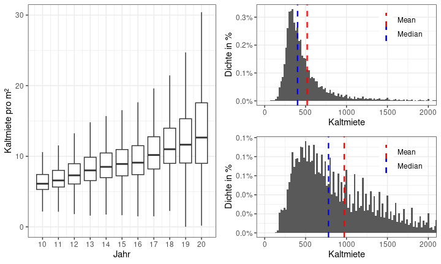
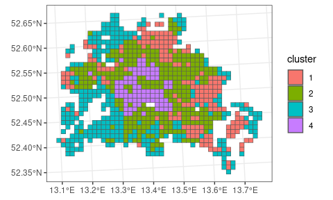
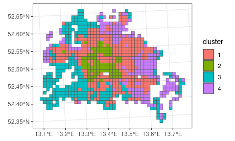
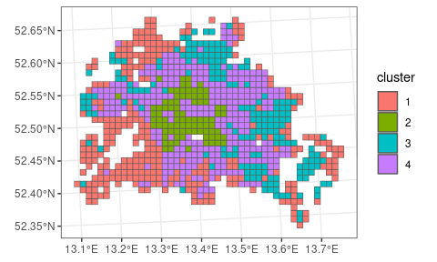
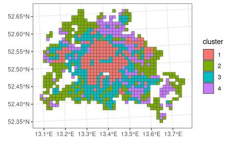

auswertung.Rmd
================
2023-12-28

# Libraries

``` r
library(ggpubr)
```

    ## Loading required package: ggplot2

``` r
library(vroom)
library(tidyverse)
```

    ## ── Attaching core tidyverse packages ──────────────────────── tidyverse 2.0.0 ──
    ## ✔ dplyr     1.1.4     ✔ readr     2.1.4
    ## ✔ forcats   1.0.0     ✔ stringr   1.5.1
    ## ✔ lubridate 1.9.3     ✔ tibble    3.2.1
    ## ✔ purrr     1.0.2     ✔ tidyr     1.3.0

    ## ── Conflicts ────────────────────────────────────────── tidyverse_conflicts() ──
    ## ✖ readr::col_character()   masks vroom::col_character()
    ## ✖ readr::col_date()        masks vroom::col_date()
    ## ✖ readr::col_datetime()    masks vroom::col_datetime()
    ## ✖ readr::col_double()      masks vroom::col_double()
    ## ✖ readr::col_factor()      masks vroom::col_factor()
    ## ✖ readr::col_guess()       masks vroom::col_guess()
    ## ✖ readr::col_integer()     masks vroom::col_integer()
    ## ✖ readr::col_logical()     masks vroom::col_logical()
    ## ✖ readr::col_number()      masks vroom::col_number()
    ## ✖ readr::col_skip()        masks vroom::col_skip()
    ## ✖ readr::col_time()        masks vroom::col_time()
    ## ✖ readr::cols()            masks vroom::cols()
    ## ✖ readr::date_names_lang() masks vroom::date_names_lang()
    ## ✖ readr::default_locale()  masks vroom::default_locale()
    ## ✖ dplyr::filter()          masks stats::filter()
    ## ✖ readr::fwf_cols()        masks vroom::fwf_cols()
    ## ✖ readr::fwf_empty()       masks vroom::fwf_empty()
    ## ✖ readr::fwf_positions()   masks vroom::fwf_positions()
    ## ✖ readr::fwf_widths()      masks vroom::fwf_widths()
    ## ✖ dplyr::lag()             masks stats::lag()
    ## ✖ readr::locale()          masks vroom::locale()
    ## ✖ readr::output_column()   masks vroom::output_column()
    ## ✖ readr::problems()        masks vroom::problems()
    ## ℹ Use the conflicted package (<http://conflicted.r-lib.org/>) to force all conflicts to become errors

``` r
library(sf)
```

    ## Linking to GEOS 3.10.2, GDAL 3.4.1, PROJ 8.2.1; sf_use_s2() is TRUE

# Importing data

Die Daten wurden im Dokument ‘cleaning.Rmd’ aufbereitet und
abgespeichert.

``` r
data_rent <- vroom("./daten/data_rent.csv")
```

    ## Rows: 1919320 Columns: 4
    ## ── Column specification ────────────────────────────────────────────────────────
    ## Delimiter: ","
    ## chr (1): r1_id
    ## dbl (3): mietekalt, wohnflaeche, jahr
    ## 
    ## ℹ Use `spec()` to retrieve the full column specification for this data.
    ## ℹ Specify the column types or set `show_col_types = FALSE` to quiet this message.

``` r
data_social <- vroom("./daten/data_social.csv")
```

    ## Rows: 11240 Columns: 12
    ## ── Column specification ────────────────────────────────────────────────────────
    ## Delimiter: ","
    ## chr  (1): r1_id
    ## dbl (11): jahr, anzahl_haushalte, arbeitslosenquote, anteil_oberklassewagen,...
    ## 
    ## ℹ Use `spec()` to retrieve the full column specification for this data.
    ## ℹ Specify the column types or set `show_col_types = FALSE` to quiet this message.

``` r
inspire_grid_berlin <- st_read("./daten/inspire_grid_berlin.gpkg")
```

    ## Reading layer `inspire_grid_berlin' from data source 
    ##   `/home/admin/workspace/immoprojekt/daten/inspire_grid_berlin.gpkg' 
    ##   using driver `GPKG'
    ## Simple feature collection with 1016 features and 17 fields
    ## Geometry type: POLYGON
    ## Dimension:     XY
    ## Bounding box:  xmin: 4531000 ymin: 3253000 xmax: 4577000 ymax: 3291000
    ## Projected CRS: ETRS89-extended / LAEA Europe

``` r
bezirksgrenzen_berlin <- st_read("./daten/bezirksgrenzen_berlin/bezirksgrenzen.shp") %>%
  st_transform("EPSG:3035")
```

    ## Reading layer `bezirksgrenzen' from data source 
    ##   `/home/admin/workspace/immoprojekt/daten/bezirksgrenzen_berlin/bezirksgrenzen.shp' 
    ##   using driver `ESRI Shapefile'
    ## Simple feature collection with 12 features and 6 fields
    ## Geometry type: MULTIPOLYGON
    ## Dimension:     XY
    ## Bounding box:  xmin: 13.08835 ymin: 52.33825 xmax: 13.76116 ymax: 52.67551
    ## Geodetic CRS:  WGS 84

# Plotting

Wie hat sich die Verteilung der Kaltmieten über die Jahre geändert?

``` r
plot1 <- data_rent %>%
  filter(jahr %in% 2010:2020) %>%
  mutate(mietekalt_m2 = mietekalt / wohnflaeche) %>%
  filter(mietekalt_m2 > 0, mietekalt_m2 < 100) %>%
  ggplot(aes(x = jahr, y = mietekalt_m2, group = jahr))+
  geom_boxplot(outlier.shape = NA)+
  coord_cartesian(ylim = c(0, 30))+
  scale_x_continuous(breaks = 2010:2020, labels = 10:20)+
  theme_bw()+
  labs(x = "Jahr", y = "Kaltmiete pro m²")

plot2 <- data_rent %>%
  filter(jahr == 2010) %>%
  filter(mietekalt > 50, mietekalt < 10000) %>%
  ggplot(aes(x = mietekalt, y = after_stat(density))) +
  geom_histogram(binwidth = 20) +
  geom_vline(aes(xintercept = mean(mietekalt), color = "Mean"), linewidth = .8, linetype = "dashed") +
  geom_vline(aes(xintercept = median(mietekalt), color = "Median"), linewidth = .8, linetype = "dashed") +
  scale_color_manual("Statistics", values = c("Mean" = "red", "Median" = "blue"))+
  coord_cartesian(xlim = c(0, 2000)) +
  scale_y_continuous(labels = scales::percent_format(accuracy = .1))+
  theme_bw() +
  theme(legend.position = c(0.8, 0.8), legend.title = element_blank(), legend.background = element_blank())+
  labs(x = "Kaltmiete", y = "Dichte in %")

plot3 <- data_rent %>%
  filter(jahr == 2020) %>%
  filter(mietekalt > 50, mietekalt < 10000) %>%
  ggplot(aes(x = mietekalt, y = after_stat(density))) +
  geom_histogram(binwidth = 20) +
  geom_vline(aes(xintercept = mean(mietekalt), color = "Mean"), linewidth = .8, linetype = "dashed") +
  geom_vline(aes(xintercept = median(mietekalt), color = "Median"), linewidth = .8, linetype = "dashed") +
  scale_color_manual("Statistics", values = c("Mean" = "red", "Median" = "blue"))+
  coord_cartesian(xlim = c(0, 2000)) +
  scale_y_continuous(labels = scales::percent_format(accuracy = .1))+
  theme_bw() +
  theme(legend.position = c(0.8, 0.8), legend.title = element_blank(), legend.background = element_blank())+
  labs(x = "Kaltmiete", y = "Dichte in %")

ggarrange(plot1,
          ggarrange(plot2, plot3, nrow = 2),
          nrow = 1)
```

<!-- -->

# Clustering

k-means clustering mit den Variablen

- arbeitslosenquote
- anteil_oberklassewagen (NICHT MEHR, weil nicht für alle Jahre
  vorhanden)
- kaufkraft_pro_haushalt
- anteil_auslaender
- anteil_efh
- anteil_60_plus

Es werden 4 Cluster verwendet. *Begründung*

``` r
data_clustering <- data_social %>%
  filter(jahr == 2015) %>%
  drop_na() %>%
  select(anzahl_haushalte, arbeitslosenquote, kaufkraft_pro_haushalt, anteil_auslaender, anteil_efh, anteil_60_plus) %>%
  as.matrix() %>%
  scale()

set.seed(1)
kmeans_result_2010 <- kmeans(data_clustering, centers = 4)

data_social %>%
  filter(jahr == 2015) %>%
  drop_na() %>%
  cbind(cluster = kmeans_result_2010$cluster) %>%
  mutate(cluster = as_factor(cluster)) %>%
  left_join(inspire_grid_berlin %>% select(r1_id), by = "r1_id") %>%
  st_as_sf() %>%
  ggplot()+
  geom_sf(aes(fill = cluster))+
  theme_bw()
```

<!-- -->

Cluster sind sehr ähnlich zu den Wahlergebnissen der Bundestagswahl in
Berlin 2016 

Wer steckt hinter den Clustern? Um diese Frage zu beantworten können wir
die Mittelwerte der jeweiligen Cluster betrachten.

``` r
kmeans_result_2010$centers %>% t() %>% round(2)
```

    ##                            1     2     3     4
    ## anzahl_haushalte       -0.63  0.29 -0.53  2.12
    ## arbeitslosenquote      -0.06  0.80 -1.02  0.79
    ## kaufkraft_pro_haushalt -0.28 -0.62  1.02 -0.67
    ## anteil_auslaender      -0.52  0.13 -0.42  2.10
    ## anteil_efh              1.03 -0.83  0.52 -1.11
    ## anteil_60_plus         -0.12 -0.21  0.72 -1.43

Die Werte können nicht direkt interpretiert werden, da sie vorher durch
`scale()` mittelwertbereinigt und varianzbereinigt wurden. Was aber
interpretiert werden kann ist der Unterschied zwischen den Werten.

Betrachten wir beispielsweise Cluster 3:

- Die Anzahl der Haushalte ist am geringsten, das heißt pro
  Quadratkilometer wohnen hier weniger Menschen als in den anderen
  Teilen Berlins.
- Die Arbeitslosenquote ist ebenfalls am kleinsten.
- Die Kaufkraft pro Haushalt ist dagegen im Vergleich am größten, es
  handelt sich also um eine wohlhabende Gegend.
- Der Anteil an Ausländern ist vergleichsweise klein, jedoch größer als
  in Cluster 1.
- Die Anzahl der Einfamilienhäuser ist im Vergleich groß, aber kleiner
  als in Cluster 1.
- Der Anteil der Bevölkerung über 60 Jahre ist ebenso mit Abstand am
  größten.

Zusammenfassend könnte man Cluster 3 also als Ort bezeichnen, wo
Reichtum, Ruhe und Rentner regieren!

## Zeitliche Stabilität der Cluster

Sind die Cluster über die Zeit stabil? Das ist wichtig falls wir
Regressionen basierend auf diesen Clusterungen vornehmen.

``` r
# Split data by year
data_clustering_year <- data_social %>%
  select(jahr, anzahl_haushalte, arbeitslosenquote, kaufkraft_pro_haushalt, anteil_auslaender, anteil_efh, anteil_60_plus) %>%
  drop_na() %>%
  group_by(jahr) %>%
  filter(jahr %in% c(2005, 2010, 2015, 2019)) %>%
  group_split(.keep = FALSE)

kmeans_result_2005 <- data_clustering_year[[1]] %>% as.matrix() %>% scale() %>%
  kmeans(., centers = 4)
kmeans_result_2005
```

    ## K-means clustering with 4 clusters of sizes 243, 84, 317, 218
    ## 
    ## Cluster means:
    ##   anzahl_haushalte arbeitslosenquote kaufkraft_pro_haushalt anteil_auslaender
    ## 1       -0.6621696        -0.2225145             -0.1705419        -0.6082571
    ## 2        2.1854296         0.7578242             -0.6426050         2.0847126
    ## 3        0.2194674         0.8174559             -0.6620805         0.1055497
    ## 4       -0.4231195        -1.2326593              1.4004588        -0.2787551
    ##   anteil_efh anteil_60_plus
    ## 1  1.0676801    -0.09593607
    ## 2 -1.0530196    -1.33133333
    ## 3 -0.7898679    -0.22849071
    ## 4  0.3641996     0.95218358
    ## 
    ## Clustering vector:
    ##   [1] 4 1 1 1 4 4 4 1 1 1 1 1 4 1 4 4 4 4 4 4 3 1 1 1 1 1 4 1 1 1 4 4 4 4 4 4 4
    ##  [38] 4 3 3 4 1 3 1 1 1 4 4 4 4 4 4 4 4 3 4 4 3 3 1 4 1 4 4 4 4 4 4 4 4 4 4 4 3
    ##  [75] 3 3 3 3 4 4 4 4 4 4 4 4 3 3 3 3 3 3 1 1 1 4 4 4 4 4 4 3 3 3 2 3 3 4 1 4 4
    ## [112] 4 3 4 4 4 4 4 4 3 3 3 3 3 4 4 4 4 4 4 4 4 4 4 4 4 4 4 4 3 3 1 1 4 4 4 4 4
    ## [149] 4 4 4 4 4 4 4 4 4 4 4 4 4 1 3 1 4 4 4 4 3 3 4 4 4 4 4 4 4 4 4 4 1 3 3 1 1
    ## [186] 3 4 4 4 4 4 3 4 4 4 3 4 4 4 4 4 4 4 3 3 3 3 3 1 4 3 3 4 4 4 4 4 4 4 4 1 4
    ## [223] 4 4 4 4 4 4 4 3 2 2 2 2 3 3 3 3 3 3 3 4 4 4 4 4 4 4 1 4 4 4 4 4 4 4 3 3 3
    ## [260] 2 2 2 2 3 3 3 3 2 3 4 4 4 4 4 1 1 3 3 3 4 3 3 2 2 2 2 2 2 3 2 2 3 1 3 3 3
    ## [297] 3 3 3 4 4 4 4 4 4 3 3 2 2 3 2 2 3 3 2 2 3 2 3 3 3 3 3 3 4 4 3 4 4 3 3 3 3
    ## [334] 2 2 2 2 2 3 2 2 2 2 3 3 3 3 3 3 4 4 4 3 3 3 3 4 4 3 3 3 2 2 2 2 3 3 2 2 2
    ## [371] 2 3 3 3 3 4 1 1 4 4 4 4 3 3 3 2 3 3 2 2 2 3 3 3 2 2 2 3 1 3 1 1 1 1 1 1 1
    ## [408] 4 4 4 4 4 4 3 3 3 3 3 2 2 2 3 3 2 2 2 3 3 3 3 3 1 1 1 1 4 3 3 4 4 4 4 3 4
    ## [445] 3 3 2 2 2 3 3 2 2 2 2 3 3 3 1 3 3 1 4 4 3 1 4 4 4 4 1 3 2 2 2 2 2 3 3 2 2
    ## [482] 2 3 3 3 3 1 3 1 1 3 4 4 3 3 3 1 3 3 3 2 2 2 2 2 3 3 3 3 3 3 1 1 1 1 1 1 3
    ## [519] 1 1 1 3 3 3 3 3 2 2 2 3 3 2 2 3 3 3 3 1 1 1 1 1 1 1 3 3 3 4 3 2 2 3 3 3 2
    ## [556] 2 3 3 3 3 3 1 3 1 1 1 3 3 3 3 4 4 3 4 4 1 3 3 3 3 3 3 3 3 3 3 3 3 3 3 1 1
    ## [593] 3 3 3 3 1 1 4 4 4 4 3 1 3 3 3 1 3 3 3 3 3 3 3 1 3 3 3 1 3 3 1 1 3 4 3 1 3
    ## [630] 3 3 3 1 3 3 3 3 3 3 3 3 3 3 3 1 1 1 1 3 1 1 1 3 3 3 3 1 3 3 3 3 1 3 3 3 3
    ## [667] 3 1 1 1 3 1 3 1 3 1 3 3 1 1 3 1 1 3 3 3 3 3 3 3 3 1 1 1 3 1 3 1 1 1 1 1 1
    ## [704] 1 3 3 3 3 3 1 1 1 1 1 1 3 3 3 3 1 1 1 1 1 3 3 1 3 3 3 3 1 1 1 3 3 3 3 3 3
    ## [741] 1 1 1 1 1 3 3 3 3 3 1 1 1 1 1 4 3 3 3 3 1 1 1 1 1 1 1 1 3 3 1 1 3 3 1 1 1
    ## [778] 1 1 1 1 1 3 3 1 1 1 4 3 3 1 1 1 1 1 1 1 1 1 1 1 1 1 1 1 1 1 1 1 1 1 1 1 1
    ## [815] 1 1 1 1 1 1 1 1 1 1 1 1 1 1 1 1 1 1 1 1 1 1 1 1 1 1 1 1 1 1 1 1 1 1 1 1 1
    ## [852] 1 1 1 1 1 1 1 1 1 1 1
    ## 
    ## Within cluster sum of squares by cluster:
    ## [1] 342.0588 409.9767 850.0412 352.6684
    ##  (between_SS / total_SS =  62.2 %)
    ## 
    ## Available components:
    ## 
    ## [1] "cluster"      "centers"      "totss"        "withinss"     "tot.withinss"
    ## [6] "betweenss"    "size"         "iter"         "ifault"

``` r
kmeans_result_2010 <- data_clustering_year[[2]] %>% as.matrix() %>% scale() %>%
  kmeans(., centers = 4)
kmeans_result_2010
```

    ## K-means clustering with 4 clusters of sizes 307, 87, 273, 202
    ## 
    ## Cluster means:
    ##   anzahl_haushalte arbeitslosenquote kaufkraft_pro_haushalt anteil_auslaender
    ## 1        0.2502852         0.8253712             -0.6107010        0.09638109
    ## 2        2.1174532         0.7781072             -0.6653026        2.10019315
    ## 3       -0.4833194        -1.0668643              1.2155056       -0.34103417
    ## 4       -0.6391574        -0.1476750             -0.4280518       -0.59011620
    ##   anteil_efh anteil_60_plus
    ## 1 -0.8072081     -0.1877075
    ## 2 -1.0866212     -1.3798540
    ## 3  0.4457675      0.7770569
    ## 4  1.0923486     -0.1706091
    ## 
    ## Clustering vector:
    ##   [1] 3 3 3 3 3 3 3 3 4 4 4 4 3 3 3 3 3 3 3 3 3 3 4 4 4 4 4 4 4 3 3 3 3 3 3 3 3
    ##  [38] 3 3 3 1 1 3 3 1 4 4 4 3 3 3 3 3 3 3 3 1 3 3 1 1 3 3 3 3 3 3 3 3 3 3 3 3 3
    ##  [75] 3 1 1 1 1 1 3 3 3 3 3 3 3 3 3 1 1 1 1 1 1 4 4 4 3 3 3 3 3 3 3 1 1 1 2 1 1
    ## [112] 4 4 3 3 3 1 3 3 3 3 3 3 1 1 1 1 1 3 3 3 3 3 3 3 3 3 3 3 3 3 3 3 1 1 4 4 3
    ## [149] 3 3 3 3 3 3 3 3 3 3 3 3 3 3 3 3 3 3 1 4 3 3 3 3 1 1 3 3 3 3 3 3 3 3 3 3 4
    ## [186] 1 1 4 3 1 3 3 3 3 3 4 3 3 3 1 3 3 3 3 3 3 3 1 1 1 1 1 4 3 1 1 3 3 3 3 3 3
    ## [223] 3 3 3 3 3 3 3 3 3 3 3 1 2 2 2 2 1 1 1 1 1 1 1 3 3 3 3 3 3 3 3 3 3 3 3 3 3
    ## [260] 3 1 1 1 2 2 2 2 1 1 1 1 2 1 3 3 3 3 3 3 3 1 1 1 3 1 1 2 2 2 2 2 2 1 2 2 1
    ## [297] 4 1 1 1 1 1 1 3 3 3 3 1 3 1 1 2 2 1 2 2 1 1 2 2 1 2 1 1 1 1 1 1 3 3 1 3 3
    ## [334] 1 1 1 1 2 2 2 2 2 2 2 2 2 2 1 1 1 1 1 1 3 3 3 1 1 1 1 3 3 1 1 2 2 2 2 2 1
    ## [371] 1 2 2 2 2 1 1 1 1 3 4 4 3 3 3 3 1 1 1 2 1 1 2 2 2 1 1 1 2 2 2 2 4 1 4 4 4
    ## [408] 4 4 3 4 3 3 3 3 3 3 1 1 1 1 1 2 2 2 1 1 2 2 2 1 1 1 1 1 4 4 4 4 3 1 1 3 3
    ## [445] 3 3 1 3 1 1 2 2 2 1 1 2 2 2 2 1 1 1 4 1 1 4 3 3 1 1 3 3 3 3 4 1 2 2 2 2 2
    ## [482] 1 1 2 2 2 1 1 1 1 4 1 4 4 1 3 3 1 1 1 4 1 1 1 2 2 2 2 2 1 1 1 1 1 1 4 4 4
    ## [519] 4 4 4 1 4 4 3 1 1 1 1 1 2 2 2 1 1 2 2 1 1 1 1 4 4 4 4 4 4 4 1 1 1 3 4 2 2
    ## [556] 1 1 1 2 2 1 1 1 1 1 4 1 4 4 4 4 1 1 1 3 3 1 3 3 4 1 1 1 1 4 1 1 1 1 1 1 1
    ## [593] 1 1 4 4 4 1 1 1 4 4 3 3 3 3 1 4 4 1 1 4 1 1 1 1 1 1 1 4 1 1 1 4 4 1 1 4 3
    ## [630] 1 3 1 4 1 1 1 1 4 1 1 1 1 1 1 1 1 1 1 1 4 4 3 3 1 4 4 4 1 1 1 1 4 1 1 1 1
    ## [667] 4 1 1 1 1 1 1 4 4 4 1 4 4 4 1 4 1 1 4 4 1 4 4 4 1 1 1 1 1 1 1 4 4 4 1 4 1
    ## [704] 4 4 4 4 4 4 4 1 1 1 1 1 4 4 4 4 4 4 1 1 1 1 4 4 4 4 4 1 1 4 1 1 1 1 4 4 4
    ## [741] 1 1 1 1 1 1 4 4 4 4 4 1 1 1 1 4 3 4 4 4 4 4 1 1 1 1 4 4 4 4 4 4 4 4 1 1 3
    ## [778] 4 1 1 4 4 4 4 4 4 4 4 1 1 3 4 3 3 1 1 4 3 3 4 4 4 4 4 3 4 3 3 3 3 3 3 3 3
    ## [815] 4 4 3 4 4 3 4 4 4 4 4 4 3 3 3 3 4 4 4 4 3 4 4 4 4 4 3 3 4 4 4 4 4 3 3 4 4
    ## [852] 4 4 4 4 4 3 4 4 4 4 4 3 3 3 3 3 3 4
    ## 
    ## Within cluster sum of squares by cluster:
    ## [1] 795.2194 421.9088 511.4863 319.5616
    ##  (between_SS / total_SS =  60.7 %)
    ## 
    ## Available components:
    ## 
    ## [1] "cluster"      "centers"      "totss"        "withinss"     "tot.withinss"
    ## [6] "betweenss"    "size"         "iter"         "ifault"

``` r
kmeans_result_2015 <- data_clustering_year[[3]] %>% as.matrix() %>% scale() %>%
  kmeans(., centers = 4)
kmeans_result_2015
```

    ## K-means clustering with 4 clusters of sizes 292, 87, 189, 303
    ## 
    ## Cluster means:
    ##   anzahl_haushalte arbeitslosenquote kaufkraft_pro_haushalt anteil_auslaender
    ## 1       -0.5275400       -1.02456040              1.0158465        -0.4188556
    ## 2        2.1218564        0.79041120             -0.6721937         2.0997909
    ## 3       -0.6249953       -0.05486627             -0.2597958        -0.5259136
    ## 4        0.2889911        0.79463890             -0.6239107         0.1287845
    ##   anteil_efh anteil_60_plus
    ## 1  0.5244351      0.7232695
    ## 2 -1.1115538     -1.4309665
    ## 3  1.0335675     -0.1277273
    ## 4 -0.8309378     -0.2064691
    ## 
    ## Clustering vector:
    ##   [1] 1 1 3 1 1 1 1 1 1 3 3 3 1 1 1 1 1 1 1 1 3 1 3 3 3 3 1 3 1 1 1 1 1 1 1 1 1
    ##  [38] 1 1 1 3 4 1 3 4 1 1 1 1 1 1 1 1 1 3 1 4 1 1 4 4 1 1 1 1 1 4 1 1 1 1 1 1 1
    ##  [75] 1 4 4 4 4 4 1 1 1 1 1 1 1 1 4 4 4 4 4 4 3 3 1 1 1 1 1 1 1 4 4 4 2 4 4 3 3
    ## [112] 3 1 1 4 1 1 1 1 1 1 4 3 4 4 4 3 1 1 3 1 1 1 1 1 1 1 1 1 1 1 1 4 3 3 1 1 1
    ## [149] 1 1 1 1 1 1 1 1 1 1 1 1 1 1 4 3 4 3 4 1 1 1 1 1 1 4 1 1 1 1 1 1 1 1 1 4 3
    ## [186] 4 4 3 1 4 1 1 1 1 1 1 1 4 1 1 4 1 1 1 1 1 1 1 4 4 4 4 4 3 1 4 4 1 1 1 1 1
    ## [223] 1 1 1 1 1 1 1 1 1 1 1 4 4 2 2 2 2 4 4 4 3 4 4 4 1 1 1 1 1 1 1 1 1 1 1 1 1
    ## [260] 1 1 4 4 4 2 2 2 2 4 4 4 4 2 4 3 3 1 1 1 1 1 4 4 4 4 4 4 2 2 2 2 2 2 4 2 2
    ## [297] 4 3 4 4 4 4 4 4 1 1 1 1 4 4 4 4 2 2 4 2 2 4 4 2 2 4 2 4 4 4 4 4 4 1 1 4 1
    ## [334] 1 4 4 4 4 2 2 2 2 2 2 2 2 2 2 4 4 4 4 4 4 3 1 3 4 4 4 4 1 4 4 4 2 2 2 2 2
    ## [371] 4 4 2 2 2 2 4 4 4 3 1 3 1 1 1 1 4 4 4 4 2 4 4 2 2 2 4 4 4 2 2 2 2 3 4 3 3
    ## [408] 3 3 3 1 1 1 1 1 1 4 1 4 4 4 4 4 2 2 2 4 4 2 2 2 4 4 4 4 4 3 3 3 3 1 4 4 1
    ## [445] 4 1 1 4 4 4 4 2 2 2 4 4 2 2 2 2 4 4 4 3 3 4 3 1 1 4 4 1 1 1 1 3 4 2 2 2 2
    ## [482] 2 4 4 2 2 2 4 4 4 4 3 3 3 3 3 1 1 4 4 4 3 4 4 4 2 2 2 2 2 4 4 4 4 4 4 3 3
    ## [519] 3 3 3 3 3 3 1 1 4 4 4 4 4 2 2 2 4 4 2 2 4 4 4 4 3 3 3 3 3 3 3 4 4 4 3 3 2
    ## [556] 2 4 4 4 2 2 4 4 4 4 3 3 4 3 3 3 3 4 4 4 1 1 4 1 1 3 4 4 4 4 3 4 4 4 4 4 4
    ## [593] 3 4 4 3 3 3 4 4 4 3 1 1 4 1 1 3 3 4 4 3 4 4 4 4 4 4 4 3 4 4 4 1 1 4 1 1 1
    ## [630] 4 1 4 3 4 4 4 4 3 4 4 4 4 3 4 4 4 4 4 4 3 1 1 1 4 3 3 3 4 4 4 4 3 4 4 4 4
    ## [667] 3 4 4 4 3 4 4 3 3 1 4 3 3 3 4 3 4 4 3 3 1 3 3 3 4 4 4 4 4 4 4 3 3 3 4 3 4
    ## [704] 1 3 3 3 3 1 3 4 4 4 4 4 1 3 3 1 3 3 4 4 4 4 3 3 3 3 3 4 4 3 4 4 4 4 3 3 3
    ## [741] 4 4 4 4 4 4 1 3 3 3 3 4 4 4 4 1 1 3 3 3 3 1 4 4 4 1 3 3 3 3 3 3 3 3 4 4 1
    ## [778] 3 4 4 3 3 1 3 3 3 3 3 4 4 1 3 1 1 4 4 3 1 1 1 3 3 3 3 1 1 1 1 1 1 1 1 1 1
    ## [815] 1 3 1 3 1 1 3 3 1 3 3 3 3 1 1 1 1 1 3 3 3 3 1 3 3 3 3 3 1 1 3 3 3 3 3 1 1
    ## [852] 3 1 3 1 1 3 3 1 1 1 1 1 1 1 1 1 1 1 1 1
    ## 
    ## Within cluster sum of squares by cluster:
    ## [1] 663.9327 409.2262 314.0620 798.6406
    ##  (between_SS / total_SS =  58.1 %)
    ## 
    ## Available components:
    ## 
    ## [1] "cluster"      "centers"      "totss"        "withinss"     "tot.withinss"
    ## [6] "betweenss"    "size"         "iter"         "ifault"

``` r
kmeans_result_2019 <- data_clustering_year[[4]] %>% as.matrix() %>% scale() %>%
  kmeans(., centers = 4)
kmeans_result_2019
```

    ## K-means clustering with 4 clusters of sizes 186, 290, 247, 162
    ## 
    ## Cluster means:
    ##   anzahl_haushalte arbeitslosenquote kaufkraft_pro_haushalt anteil_auslaender
    ## 1       1.42241058         1.0011744             -0.6865915         1.2282912
    ## 2      -0.56829919        -0.9887374              0.9665603        -0.6838366
    ## 3       0.01061176         0.3202680             -0.2533809         0.2475437
    ## 4      -0.63199203         0.1321555             -0.5556259        -0.5635360
    ##   anteil_efh anteil_60_plus
    ## 1 -1.0901712     -1.1556239
    ## 2  0.7954763      0.6021112
    ## 3 -0.6809559      0.3517754
    ## 4  0.8659248     -0.2873750
    ## 
    ## Clustering vector:
    ##   [1] 2 4 2 4 2 2 2 2 2 2 4 4 2 2 2 2 2 2 2 2 2 2 2 2 4 4 2 4 2 4 2 2 4 4 2 2 2
    ##  [38] 2 2 2 2 2 4 3 2 3 3 2 2 2 4 2 2 3 3 2 4 2 2 2 1 3 2 3 3 2 4 2 2 2 3 3 2 2
    ##  [75] 2 2 2 2 2 1 3 3 1 3 2 2 2 2 2 2 2 2 2 1 1 1 1 3 3 3 4 4 2 2 2 2 4 2 2 1 1
    ## [112] 1 1 1 3 4 4 4 2 2 2 2 2 2 2 2 3 3 3 1 1 3 4 2 2 4 2 2 2 2 3 2 2 3 3 3 3 4
    ## [149] 3 1 4 4 2 2 2 2 2 2 2 2 2 2 2 3 2 4 3 2 3 3 3 3 4 4 2 2 2 2 2 2 3 2 3 3 2
    ## [186] 3 3 3 4 3 3 4 1 3 4 2 3 3 2 2 2 2 2 3 2 2 3 2 3 3 2 3 3 3 3 3 3 3 3 4 2 3
    ## [223] 1 2 2 2 2 2 2 2 2 2 4 2 2 3 2 2 3 3 3 1 1 1 1 3 3 3 3 4 3 3 2 2 2 2 2 2 2
    ## [260] 2 2 3 3 3 3 3 3 3 3 3 1 1 1 1 1 3 3 3 1 3 3 3 2 2 2 2 2 3 3 3 3 3 1 1 1 1
    ## [297] 1 1 1 1 1 1 4 4 3 1 3 3 3 3 2 2 2 2 3 3 3 1 1 1 1 1 1 3 3 1 1 1 1 1 3 3 3
    ## [334] 1 3 2 2 3 3 3 1 3 1 1 1 1 1 1 1 1 1 1 1 1 1 1 1 3 1 1 2 2 2 3 3 3 3 3 3 3
    ## [371] 3 1 1 1 1 1 1 1 1 1 1 1 3 3 3 4 2 4 4 2 3 3 2 3 3 1 1 1 1 3 1 1 1 3 1 1 1
    ## [408] 1 1 1 2 3 4 4 4 4 4 2 2 2 2 2 2 3 2 3 3 3 3 1 1 1 1 3 1 1 1 1 1 1 3 1 4 4
    ## [445] 4 4 4 2 3 3 2 3 3 2 3 3 3 3 1 1 1 3 1 1 1 1 1 1 3 3 4 4 3 4 3 3 3 3 3 3 2
    ## [482] 2 4 1 1 1 1 1 1 3 3 1 1 1 1 3 3 3 4 4 4 4 4 4 2 2 3 3 3 3 3 3 1 1 1 1 1 1
    ## [519] 1 1 1 1 1 3 4 2 4 4 4 4 4 4 2 2 3 3 3 3 3 1 1 1 1 1 1 1 3 3 1 3 4 2 4 4 4
    ## [556] 2 4 1 1 3 3 4 1 1 3 1 1 1 1 1 3 3 3 4 2 4 4 4 4 4 3 3 4 2 2 1 2 2 4 3 3 3
    ## [593] 3 4 1 1 1 3 1 3 3 4 3 4 4 4 3 3 3 2 4 4 2 2 3 2 3 4 3 3 4 4 3 1 1 3 1 1 3
    ## [630] 4 1 1 4 2 2 3 3 2 2 3 2 3 4 3 3 3 1 4 3 3 3 3 4 1 4 4 4 1 1 4 2 2 2 3 4 4
    ## [667] 4 4 3 3 3 4 3 3 3 1 4 3 3 4 4 1 4 4 4 2 3 4 4 4 3 2 3 3 4 4 2 2 4 4 1 3 1
    ## [704] 3 1 4 3 4 4 4 4 3 4 3 3 2 2 2 2 4 2 2 3 1 1 1 1 2 4 2 2 4 4 3 3 3 3 4 2 2
    ## [741] 4 4 3 3 2 3 1 1 1 4 2 2 3 3 4 1 3 3 2 2 2 2 2 1 1 1 1 2 2 2 4 4 2 2 3 3 3
    ## [778] 3 2 2 2 2 4 2 4 4 1 1 2 2 3 3 4 2 2 2 2 2 2 4 1 1 2 2 2 2 3 3 4 2 2 2 2 2
    ## [815] 2 2 2 2 2 2 2 2 2 2 2 2 3 4 2 2 2 2 4 4 2 4 4 4 4 2 2 2 2 4 4 4 4 4 2 4 3
    ## [852] 4 4 4 4 4 2 2 4 2 4 4 2 2 2 2 4 2 2 2 2 2 2 2 2 2 2 2 2 2 2 2 2 2 2
    ## 
    ## Within cluster sum of squares by cluster:
    ## [1] 679.0454 638.8289 611.9139 396.0472
    ##  (between_SS / total_SS =  56.1 %)
    ## 
    ## Available components:
    ## 
    ## [1] "cluster"      "centers"      "totss"        "withinss"     "tot.withinss"
    ## [6] "betweenss"    "size"         "iter"         "ifault"

``` r
data_social %>%
  filter(jahr == 2005) %>%
  select(r1_id, jahr, anzahl_haushalte, arbeitslosenquote, kaufkraft_pro_haushalt, anteil_auslaender, anteil_efh, anteil_60_plus) %>%
  drop_na() %>%
  cbind(cluster = kmeans_result_2005$cluster) %>%
  mutate(cluster = as_factor(cluster)) %>%
  left_join(inspire_grid_berlin %>% select(r1_id), by = "r1_id") %>%
  st_as_sf() %>%
  ggplot()+
  geom_sf(aes(fill = cluster))+
  theme_bw()
```

<!-- -->

``` r
data_social %>%
  filter(jahr == 2010) %>%
  select(r1_id, jahr, anzahl_haushalte, arbeitslosenquote, kaufkraft_pro_haushalt, anteil_auslaender, anteil_efh, anteil_60_plus) %>%
  drop_na() %>%
  cbind(cluster = kmeans_result_2010$cluster) %>%
  mutate(cluster = as_factor(cluster)) %>%
  left_join(inspire_grid_berlin %>% select(r1_id), by = "r1_id") %>%
  st_as_sf() %>%
  ggplot()+
  geom_sf(aes(fill = cluster))+
  theme_bw()
```

<!-- -->

``` r
data_social %>%
  filter(jahr == 2015) %>%
  select(r1_id, jahr, anzahl_haushalte, arbeitslosenquote, kaufkraft_pro_haushalt, anteil_auslaender, anteil_efh, anteil_60_plus) %>%
  drop_na() %>%
  cbind(cluster = kmeans_result_2015$cluster) %>%
  mutate(cluster = as_factor(cluster)) %>%
  left_join(inspire_grid_berlin %>% select(r1_id), by = "r1_id") %>%
  st_as_sf() %>%
  ggplot()+
  geom_sf(aes(fill = cluster))+
  theme_bw()
```

<!-- -->

``` r
data_social %>%
  filter(jahr == 2019) %>%
  select(r1_id, jahr, anzahl_haushalte, arbeitslosenquote, kaufkraft_pro_haushalt, anteil_auslaender, anteil_efh, anteil_60_plus) %>%
  drop_na() %>%
  cbind(cluster = kmeans_result_2019$cluster) %>%
  mutate(cluster = as_factor(cluster)) %>%
  left_join(inspire_grid_berlin %>% select(r1_id), by = "r1_id") %>%
  st_as_sf() %>%
  ggplot()+
  geom_sf(aes(fill = cluster))+
  theme_bw()
```

<!-- -->

**Ergebnis:** Die Cluster sind über die Zeit ziemlich stabil. Erst in
2019 lassen sich einige größere Unterschiede bzw. Abweichungen erkennen.
