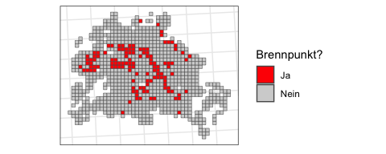

auswertung.Rmd
================
2023-12-28

# Libraries

``` r
# Für Korrelationsmatrizen
library(Hmisc)

# Für Übersichts-Plots
#library(GGally)

# Für schönere Latex-Tabellen
library(stargazer)
library(kableExtra)
library(vtable)

# Für heteroscedasticity-consistent tests
library(sandwich)
library(lmtest)

# Für schönere Plots
library(ggpubr)
library(ggrepel)

# Für schnelleres Einlesen von Daten
library(vroom)

# Für allgemeine Datenmanipulation und Plotten
library(tidyverse)

# Fürs Arbeiten mit Geodaten
library(sf)
```

# Importieren der Daten

Die Daten wurden im Dokument ‘cleaning.Rmd’ aufbereitet und
abgespeichert.

``` r
data_rent <- vroom("./daten/data_rent.csv")
data_social <- vroom("./daten/data_social.csv")

inspire_grid_berlin <- st_read("./daten/inspire_grid_berlin.gpkg")
```

    ## Reading layer `inspire_grid_berlin' from data source 
    ##   `/home/admin/workspace/immoprojekt/daten/inspire_grid_berlin.gpkg' 
    ##   using driver `GPKG'
    ## Simple feature collection with 1016 features and 17 fields
    ## Geometry type: POLYGON
    ## Dimension:     XY
    ## Bounding box:  xmin: 4531000 ymin: 3253000 xmax: 4577000 ymax: 3291000
    ## Projected CRS: ETRS89-extended / LAEA Europe

``` r
bezirksgrenzen_berlin <- st_read("./daten/bezirksgrenzen_berlin/bezirksgrenzen.shp") %>%
  st_transform("EPSG:3035")
```

    ## Reading layer `bezirksgrenzen' from data source 
    ##   `/home/admin/workspace/immoprojekt/daten/bezirksgrenzen_berlin/bezirksgrenzen.shp' 
    ##   using driver `ESRI Shapefile'
    ## Simple feature collection with 12 features and 6 fields
    ## Geometry type: MULTIPOLYGON
    ## Dimension:     XY
    ## Bounding box:  xmin: 13.08835 ymin: 52.33825 xmax: 13.76116 ymax: 52.67551
    ## Geodetic CRS:  WGS 84

# Summary Statistics

**TODO**

Überblick über die beiden Datensätze mit Anzahl an Beobachtungen,
Mittelwert, Median, Quartilen und mehr.

``` r
data_social %>% select(-jahr, -r1_id) %>%
  pivot_longer(cols = everything()) %>%
  group_by(name) %>%
  drop_na() %>%
  summarise(n = n(), 
            mean = mean(value),
            Std.Dev. = sd(value),
            min = min(value),
            Pctl.25 = quantile(value, probs = 0.25),
            Pctl.50 = quantile(value, probs = 0.5),
            Pctl.75 = quantile(value, probs = 0.75),
            max = max(value))
```

    ## # A tibble: 10 × 9
    ##    name                n    mean Std.Dev.     min Pctl.25 Pctl.50 Pctl.75    max
    ##    <chr>           <int>   <dbl>    <dbl>   <dbl>   <dbl>   <dbl>   <dbl>  <dbl>
    ##  1 anteil_60_plus  11205 2.80e+1    6.81  7.77e+0 2.37e+1 2.85e+1 3.28e+1 1   e2
    ##  2 anteil_auslaen… 11205 1.01e+1   10.2   0       3.31e+0 6.10e+0 1.34e+1 7.48e1
    ##  3 anteil_efh      11205 3.68e+1   31.5   0       6.23e+0 3.08e+1 6.32e+1 1.00e2
    ##  4 anteil_mfh      11205 2.68e+1   17.9   0       1.22e+1 2.53e+1 3.9 e+1 1   e2
    ##  5 anteil_oberkla…  9319 5.25e+0    2.49  0       3.56e+0 4.8 e+0 6.38e+0 2.63e1
    ##  6 anteil_wohnblo… 11205 3.27e+1   30.8   0       2.98e+0 2.49e+1 5.79e+1 1   e2
    ##  7 anzahl_haushal… 10487 2.24e+3 2574.    0       4.08e+2 1.30e+3 3.16e+3 1.47e4
    ##  8 arbeitslosenqu… 11205 8.54e+0    5.14  0       4.49e+0 8.15e+0 1.19e+1 2.66e1
    ##  9 kaufkraft_pro_… 10452 4.01e+4 8689.    1.87e+4 3.36e+4 3.89e+4 4.57e+4 7.99e4
    ## 10 kreditrisiko    11205 5.99e-1    0.204 1.11e-1 4.31e-1 5.93e-1 7.76e-1 1   e0

``` r
data_rent %>% select(-jahr, -r1_id) %>%
  pivot_longer(cols = everything()) %>%
  group_by(name) %>%
  drop_na() %>%
  summarise(n = n(), 
            mean = mean(value),
            Std.Dev. = sd(value),
            min = min(value),
            Pctl.25 = quantile(value, probs = 0.25),
            Pctl.50 = quantile(value, probs = 0.5),
            Pctl.75 = quantile(value, probs = 0.75),
            max = max(value))
```

    ## # A tibble: 3 × 9
    ##   name               n   mean Std.Dev.       min Pctl.25 Pctl.50 Pctl.75    max
    ##   <chr>          <int>  <dbl>    <dbl>     <dbl>   <dbl>   <dbl>   <dbl>  <dbl>
    ## 1 mietekalt    1917043 627.      517.  0.01       346      468.   707.   15000 
    ## 2 mietekalt_m2 1917043   8.50    115.  0.0000820    5.59     7      9.45 58000.
    ## 3 wohnflaeche  1917043  75.8      35.6 0.0100      55.0     68.9   88     1000

Korrelation zwischen Variablen

``` r
mcor_social <- data_social %>%
  select_if(is.numeric) %>%
  select(-jahr) %>%
  as.matrix() %>%
  Hmisc::rcorr() %>%
  .$r
mcor_social[upper.tri(mcor_social)] <- NA

mcor_social %>%
  data.frame() %>%
  round(2)
```

    ##                        anzahl_haushalte arbeitslosenquote
    ## anzahl_haushalte                   1.00                NA
    ## arbeitslosenquote                  0.40              1.00
    ## anteil_oberklassewagen            -0.02             -0.16
    ## kaufkraft_pro_haushalt            -0.33             -0.71
    ## anteil_efh                        -0.63             -0.50
    ## anteil_mfh                        -0.20             -0.08
    ## anteil_wohnblock                   0.74              0.56
    ## anteil_auslaender                  0.40              0.12
    ## kreditrisiko                       0.56              0.59
    ## anteil_60_plus                    -0.44             -0.48
    ##                        anteil_oberklassewagen kaufkraft_pro_haushalt anteil_efh
    ## anzahl_haushalte                           NA                     NA         NA
    ## arbeitslosenquote                          NA                     NA         NA
    ## anteil_oberklassewagen                   1.00                     NA         NA
    ## kaufkraft_pro_haushalt                   0.19                   1.00         NA
    ## anteil_efh                              -0.01                   0.42       1.00
    ## anteil_mfh                               0.03                   0.07      -0.31
    ## anteil_wohnblock                        -0.04                  -0.44      -0.81
    ## anteil_auslaender                        0.06                  -0.10      -0.37
    ## kreditrisiko                            -0.15                  -0.52      -0.68
    ## anteil_60_plus                           0.18                   0.39       0.30
    ##                        anteil_mfh anteil_wohnblock anteil_auslaender
    ## anzahl_haushalte               NA               NA                NA
    ## arbeitslosenquote              NA               NA                NA
    ## anteil_oberklassewagen         NA               NA                NA
    ## kaufkraft_pro_haushalt         NA               NA                NA
    ## anteil_efh                     NA               NA                NA
    ## anteil_mfh                   1.00               NA                NA
    ## anteil_wohnblock            -0.22             1.00                NA
    ## anteil_auslaender           -0.10             0.43              1.00
    ## kreditrisiko                -0.04             0.70              0.45
    ## anteil_60_plus               0.28            -0.46             -0.23
    ##                        kreditrisiko anteil_60_plus
    ## anzahl_haushalte                 NA             NA
    ## arbeitslosenquote                NA             NA
    ## anteil_oberklassewagen           NA             NA
    ## kaufkraft_pro_haushalt           NA             NA
    ## anteil_efh                       NA             NA
    ## anteil_mfh                       NA             NA
    ## anteil_wohnblock                 NA             NA
    ## anteil_auslaender                NA             NA
    ## kreditrisiko                   1.00             NA
    ## anteil_60_plus                -0.46              1

``` r
# Hinzufügen, um Latex Tabelle zu erhalten
#  %>%
#  kbl(
#    format = "latex",
#    digits = 2,
#    booktabs = T,
#    toprule = "\\hline \\hline",
#    midrule = "\\hline",
#    bottomrule = "\\hline \\hline",
#    linesep = "",
#  ) %>%
#  cat()

mcor_social %>%
  data.frame() %>%
  round(2) %>%
  rownames_to_column() %>%
  pivot_longer(cols = -rowname) %>%
  filter(!is.na(value), value != 1) %>%
  arrange(desc(value)) %>%
  rename(variable1 = rowname, variable2 = name, korrelation = value)
```

    ## # A tibble: 45 × 3
    ##    variable1         variable2              korrelation
    ##    <chr>             <chr>                        <dbl>
    ##  1 anteil_wohnblock  anzahl_haushalte              0.74
    ##  2 kreditrisiko      anteil_wohnblock              0.7 
    ##  3 kreditrisiko      arbeitslosenquote             0.59
    ##  4 anteil_wohnblock  arbeitslosenquote             0.56
    ##  5 kreditrisiko      anzahl_haushalte              0.56
    ##  6 kreditrisiko      anteil_auslaender             0.45
    ##  7 anteil_auslaender anteil_wohnblock              0.43
    ##  8 anteil_efh        kaufkraft_pro_haushalt        0.42
    ##  9 arbeitslosenquote anzahl_haushalte              0.4 
    ## 10 anteil_auslaender anzahl_haushalte              0.4 
    ## # ℹ 35 more rows

Die größte Korrelation liegt zwischen dem Anteil an Wohnblocks und der
Anzahl der Haushalte vor. Das ist soweit nicht überraschend. Als
nächstes folgt mit einem Korrelationskoeffizienten von 0.7 der
Zusammenhang zwischen dem Kreditrisiko und dem Anteil an Wohnblocks.

# Plotting

## Berlin Karte

Der INSPIRE Grid mit den Berliner Bezirken

``` r
ggplot()+
  geom_sf(data = inspire_grid_berlin)+
  geom_sf(data = bezirksgrenzen_berlin, fill = "white", alpha = .8, color = "black")+
  ggrepel::geom_label_repel(data = bezirksgrenzen_berlin %>% mutate(Gemeinde_n = str_replace(Gemeinde_n, "-", "-\n")), 
                           aes(label = Gemeinde_n, geometry = geometry),
                           stat = "sf_coordinates",
                           min.segment.length = 0.2, 
                           force_pull = 50,
                           box.padding = 0.1,
                           label.padding = .1,
                           size = 2,
                           label.r = 0,
                           lineheight = 1,
                           fill = "white")+
  coord_sf(crs = 3035)+
  #geom_sf_text(data = bezirksgrenzen_berlin %>% mutate(Gemeinde_n = str_replace(Gemeinde_n, "-", "-\n")), aes(label = Gemeinde_n), size = 3)+
  theme_bw()
```

<!-- -->

``` r
ggsave("./plots/plot_berlin_karte.pdf")
```

    ## Saving 5 x 3 in image

Der hier gezeigt Teil des Grids hat 1016 Quadrate, also eine Fläche von
1016km². Berlin hat genaugenommen nur eine Fläche von 891,8 km², wir
betrachten also auch teilweise Flächen, die eigentlich nicht mehr zu
Berlin gehören, da wir alle Quadrate einbeziehen, die (auch nur
teilweise) mit den Stadtgrenzen überlappen. Die andere Möglichkeit wäre
gewesen, die Fläche zu unterschätzen und nur Quadrate zu betrachten, die
komplett innerhalb der Stadtgrenzen liegen.

## Rent Daten

Wie hat sich die Verteilung der Kaltmieten über die Jahre geändert?

``` r
plot1 <- data_rent %>%
  filter(jahr %in% 2010:2020) %>%
  mutate(mietekalt_m2 = mietekalt / wohnflaeche) %>%
  filter(mietekalt_m2 > 0, mietekalt_m2 < 100) %>%
  ggplot(aes(x = jahr, y = mietekalt_m2, group = jahr))+
  geom_boxplot(outlier.shape = NA)+
  coord_cartesian(ylim = c(0, 30))+
  scale_x_continuous(breaks = 2010:2020, labels = 10:20)+
  theme_bw()+
  labs(x = "Jahr", y = "Kaltmiete pro m²")

plot2 <- data_rent %>%
  filter(jahr == 2010) %>%
  filter(mietekalt > 50, mietekalt < 10000) %>%
  ggplot(aes(x = mietekalt, y = after_stat(density))) +
  geom_histogram(binwidth = 20) +
  geom_vline(aes(xintercept = mean(mietekalt), color = "Mean"), linewidth = .8, linetype = "dashed") +
  geom_vline(aes(xintercept = median(mietekalt), color = "Median"), linewidth = .8, linetype = "dashed") +
  scale_color_manual("Statistics", values = c("Mean" = "red", "Median" = "blue"))+
  coord_cartesian(xlim = c(0, 2000)) +
  scale_y_continuous(labels = scales::percent_format(accuracy = .1))+
  theme_bw() +
  theme(legend.position = c(0.8, 0.8), legend.title = element_blank(), legend.background = element_blank())+
  labs(x = "Kaltmiete 2010", y = "Dichte in %")

plot3 <- data_rent %>%
  filter(jahr == 2020) %>%
  filter(mietekalt > 50, mietekalt < 10000) %>%
  ggplot(aes(x = mietekalt, y = after_stat(density))) +
  geom_histogram(binwidth = 20) +
  geom_vline(aes(xintercept = mean(mietekalt), color = "Mean"), linewidth = .8, linetype = "dashed") +
  geom_vline(aes(xintercept = median(mietekalt), color = "Median"), linewidth = .8, linetype = "dashed") +
  scale_color_manual("Statistics", values = c("Mean" = "red", "Median" = "blue"))+
  coord_cartesian(xlim = c(0, 2000)) +
  scale_y_continuous(labels = scales::percent_format(accuracy = .1))+
  theme_bw() +
  theme(legend.position = c(0.8, 0.8), legend.title = element_blank(), legend.background = element_blank())+
  labs(x = "Kaltmiete 2020", y = "Dichte in %")

ggarrange(plot1,
          ggarrange(plot2, plot3, nrow = 2),
          nrow = 1)
```

<!-- -->

``` r
ggsave("./plots/plot_miete.pdf")
```

    ## Saving 7.5 x 4.5 in image

Mittlere Kaltmiete auf Karte

``` r
data_rent_sf <- data_rent %>%
  left_join(inspire_grid_berlin %>% select(r1_id, geom), by = "r1_id") %>%
  st_as_sf()

data_rent_sf_plot <- data_rent_sf %>%
  filter(jahr == 2015) %>%
  group_by(r1_id) %>%
  summarise(mietekalt = mean(mietekalt),
            wohnflaeche = mean(wohnflaeche),
            mietekalt_m2 = mean(mietekalt_m2))

plot1 <- data_rent_sf_plot %>%
  filter(mietekalt > quantile(mietekalt, probs = 0.01), mietekalt < quantile(mietekalt, probs = 0.99)) %>%
  ggplot()+
  geom_sf(aes(fill = mietekalt))+
  scale_fill_viridis_c(trans = "log10", breaks = c(400, 600, 900, 1300))+
  theme_bw()+
  theme(legend.position = "top",
        axis.ticks = element_blank(),
        axis.text = element_blank(),
        plot.subtitle = element_text(hjust = .5),
        legend.margin = margin(t = 0, b = -5, l = 0, r = 0))+
  labs(fill = element_blank(),
       subtitle = "Kaltmiete (€)")

plot2 <- data_rent_sf_plot %>%
  filter(wohnflaeche > quantile(wohnflaeche, probs = 0.01), wohnflaeche < quantile(wohnflaeche, probs = 0.99)) %>%
  ggplot()+
  geom_sf(aes(fill = wohnflaeche))+
  scale_fill_viridis_c(trans = "log10", breaks = c(50, 70, 100, 130))+
  theme_bw()+
  theme(legend.position = "top",
        axis.ticks = element_blank(),
        axis.text = element_blank(),
        plot.subtitle = element_text(hjust = .5),
        legend.margin = margin(t = 0, b = -5, l = 0, r = 0))+
  labs(fill = element_blank(),
       subtitle = "Wohnfläche (m²)")

plot3 <- data_rent_sf_plot %>%
  filter(mietekalt_m2 > quantile(mietekalt_m2, probs = 0.01), mietekalt_m2 < quantile(mietekalt_m2, probs = 0.99)) %>%
  ggplot()+
  geom_sf(aes(fill = mietekalt_m2))+
  scale_fill_viridis_c(trans = "log10", breaks = c(6, 8, 10, 12, 14))+
  theme_bw()+
  theme(legend.position = "top",
        axis.ticks = element_blank(),
        axis.text = element_blank(),
        plot.subtitle = element_text(hjust = .5),
        legend.margin = margin(t = 0, b = -5, l = 0, r = 0))+
  labs(fill = element_blank(),
       subtitle = "Kaltmiete (€/m²)")

ggarrange(plot1, plot2, plot3, nrow = 1)
```

<!-- -->

``` r
#rm(data_rent_sf_plot)

ggsave("./plots/plot_miete_karte_2015.pdf")
```

    ## Saving 7.5 x 2.5 in image

    ## Warning in grid.Call(C_textBounds, as.graphicsAnnot(x$label), x$x, x$y, :
    ## conversion failure on 'Kaltmiete (€)' in 'mbcsToSbcs': dot substituted for <e2>

    ## Warning in grid.Call(C_textBounds, as.graphicsAnnot(x$label), x$x, x$y, :
    ## conversion failure on 'Kaltmiete (€)' in 'mbcsToSbcs': dot substituted for <82>

    ## Warning in grid.Call(C_textBounds, as.graphicsAnnot(x$label), x$x, x$y, :
    ## conversion failure on 'Kaltmiete (€)' in 'mbcsToSbcs': dot substituted for <ac>

    ## Warning in grid.Call(C_textBounds, as.graphicsAnnot(x$label), x$x, x$y, :
    ## conversion failure on 'Kaltmiete (€)' in 'mbcsToSbcs': dot substituted for <e2>

    ## Warning in grid.Call(C_textBounds, as.graphicsAnnot(x$label), x$x, x$y, :
    ## conversion failure on 'Kaltmiete (€)' in 'mbcsToSbcs': dot substituted for <82>

    ## Warning in grid.Call(C_textBounds, as.graphicsAnnot(x$label), x$x, x$y, :
    ## conversion failure on 'Kaltmiete (€)' in 'mbcsToSbcs': dot substituted for <ac>

    ## Warning in grid.Call(C_textBounds, as.graphicsAnnot(x$label), x$x, x$y, :
    ## conversion failure on 'Kaltmiete (€)' in 'mbcsToSbcs': dot substituted for <e2>

    ## Warning in grid.Call(C_textBounds, as.graphicsAnnot(x$label), x$x, x$y, :
    ## conversion failure on 'Kaltmiete (€)' in 'mbcsToSbcs': dot substituted for <82>

    ## Warning in grid.Call(C_textBounds, as.graphicsAnnot(x$label), x$x, x$y, :
    ## conversion failure on 'Kaltmiete (€)' in 'mbcsToSbcs': dot substituted for <ac>

    ## Warning in grid.Call(C_textBounds, as.graphicsAnnot(x$label), x$x, x$y, :
    ## conversion failure on 'Kaltmiete (€)' in 'mbcsToSbcs': dot substituted for <e2>

    ## Warning in grid.Call(C_textBounds, as.graphicsAnnot(x$label), x$x, x$y, :
    ## conversion failure on 'Kaltmiete (€)' in 'mbcsToSbcs': dot substituted for <82>

    ## Warning in grid.Call(C_textBounds, as.graphicsAnnot(x$label), x$x, x$y, :
    ## conversion failure on 'Kaltmiete (€)' in 'mbcsToSbcs': dot substituted for <ac>

    ## Warning in grid.Call(C_textBounds, as.graphicsAnnot(x$label), x$x, x$y, :
    ## conversion failure on 'Kaltmiete (€)' in 'mbcsToSbcs': dot substituted for <e2>

    ## Warning in grid.Call(C_textBounds, as.graphicsAnnot(x$label), x$x, x$y, :
    ## conversion failure on 'Kaltmiete (€)' in 'mbcsToSbcs': dot substituted for <82>

    ## Warning in grid.Call(C_textBounds, as.graphicsAnnot(x$label), x$x, x$y, :
    ## conversion failure on 'Kaltmiete (€)' in 'mbcsToSbcs': dot substituted for <ac>

    ## Warning in grid.Call(C_textBounds, as.graphicsAnnot(x$label), x$x, x$y, :
    ## conversion failure on 'Kaltmiete (€)' in 'mbcsToSbcs': dot substituted for <e2>

    ## Warning in grid.Call(C_textBounds, as.graphicsAnnot(x$label), x$x, x$y, :
    ## conversion failure on 'Kaltmiete (€)' in 'mbcsToSbcs': dot substituted for <82>

    ## Warning in grid.Call(C_textBounds, as.graphicsAnnot(x$label), x$x, x$y, :
    ## conversion failure on 'Kaltmiete (€)' in 'mbcsToSbcs': dot substituted for <ac>

    ## Warning in grid.Call(C_textBounds, as.graphicsAnnot(x$label), x$x, x$y, :
    ## conversion failure on 'Kaltmiete (€)' in 'mbcsToSbcs': dot substituted for <e2>

    ## Warning in grid.Call(C_textBounds, as.graphicsAnnot(x$label), x$x, x$y, :
    ## conversion failure on 'Kaltmiete (€)' in 'mbcsToSbcs': dot substituted for <82>

    ## Warning in grid.Call(C_textBounds, as.graphicsAnnot(x$label), x$x, x$y, :
    ## conversion failure on 'Kaltmiete (€)' in 'mbcsToSbcs': dot substituted for <ac>

    ## Warning in grid.Call.graphics(C_text, as.graphicsAnnot(x$label), x$x, x$y, :
    ## conversion failure on 'Kaltmiete (€)' in 'mbcsToSbcs': dot substituted for <e2>

    ## Warning in grid.Call.graphics(C_text, as.graphicsAnnot(x$label), x$x, x$y, :
    ## conversion failure on 'Kaltmiete (€)' in 'mbcsToSbcs': dot substituted for <82>

    ## Warning in grid.Call.graphics(C_text, as.graphicsAnnot(x$label), x$x, x$y, :
    ## conversion failure on 'Kaltmiete (€)' in 'mbcsToSbcs': dot substituted for <ac>

    ## Warning in grid.Call.graphics(C_text, as.graphicsAnnot(x$label), x$x, x$y, :
    ## conversion failure on 'Kaltmiete (€)' in 'mbcsToSbcs': dot substituted for <e2>

    ## Warning in grid.Call.graphics(C_text, as.graphicsAnnot(x$label), x$x, x$y, :
    ## conversion failure on 'Kaltmiete (€)' in 'mbcsToSbcs': dot substituted for <82>

    ## Warning in grid.Call.graphics(C_text, as.graphicsAnnot(x$label), x$x, x$y, :
    ## conversion failure on 'Kaltmiete (€)' in 'mbcsToSbcs': dot substituted for <ac>

    ## Warning in grid.Call(C_textBounds, as.graphicsAnnot(x$label), x$x, x$y, :
    ## conversion failure on 'Kaltmiete (€/m²)' in 'mbcsToSbcs': dot substituted for
    ## <e2>

    ## Warning in grid.Call(C_textBounds, as.graphicsAnnot(x$label), x$x, x$y, :
    ## conversion failure on 'Kaltmiete (€/m²)' in 'mbcsToSbcs': dot substituted for
    ## <82>

    ## Warning in grid.Call(C_textBounds, as.graphicsAnnot(x$label), x$x, x$y, :
    ## conversion failure on 'Kaltmiete (€/m²)' in 'mbcsToSbcs': dot substituted for
    ## <ac>

    ## Warning in grid.Call(C_textBounds, as.graphicsAnnot(x$label), x$x, x$y, :
    ## conversion failure on 'Kaltmiete (€/m²)' in 'mbcsToSbcs': dot substituted for
    ## <e2>

    ## Warning in grid.Call(C_textBounds, as.graphicsAnnot(x$label), x$x, x$y, :
    ## conversion failure on 'Kaltmiete (€/m²)' in 'mbcsToSbcs': dot substituted for
    ## <82>

    ## Warning in grid.Call(C_textBounds, as.graphicsAnnot(x$label), x$x, x$y, :
    ## conversion failure on 'Kaltmiete (€/m²)' in 'mbcsToSbcs': dot substituted for
    ## <ac>

    ## Warning in grid.Call(C_textBounds, as.graphicsAnnot(x$label), x$x, x$y, :
    ## conversion failure on 'Kaltmiete (€/m²)' in 'mbcsToSbcs': dot substituted for
    ## <e2>

    ## Warning in grid.Call(C_textBounds, as.graphicsAnnot(x$label), x$x, x$y, :
    ## conversion failure on 'Kaltmiete (€/m²)' in 'mbcsToSbcs': dot substituted for
    ## <82>

    ## Warning in grid.Call(C_textBounds, as.graphicsAnnot(x$label), x$x, x$y, :
    ## conversion failure on 'Kaltmiete (€/m²)' in 'mbcsToSbcs': dot substituted for
    ## <ac>

    ## Warning in grid.Call(C_textBounds, as.graphicsAnnot(x$label), x$x, x$y, :
    ## conversion failure on 'Kaltmiete (€/m²)' in 'mbcsToSbcs': dot substituted for
    ## <e2>

    ## Warning in grid.Call(C_textBounds, as.graphicsAnnot(x$label), x$x, x$y, :
    ## conversion failure on 'Kaltmiete (€/m²)' in 'mbcsToSbcs': dot substituted for
    ## <82>

    ## Warning in grid.Call(C_textBounds, as.graphicsAnnot(x$label), x$x, x$y, :
    ## conversion failure on 'Kaltmiete (€/m²)' in 'mbcsToSbcs': dot substituted for
    ## <ac>

    ## Warning in grid.Call(C_textBounds, as.graphicsAnnot(x$label), x$x, x$y, :
    ## conversion failure on 'Kaltmiete (€/m²)' in 'mbcsToSbcs': dot substituted for
    ## <e2>

    ## Warning in grid.Call(C_textBounds, as.graphicsAnnot(x$label), x$x, x$y, :
    ## conversion failure on 'Kaltmiete (€/m²)' in 'mbcsToSbcs': dot substituted for
    ## <82>

    ## Warning in grid.Call(C_textBounds, as.graphicsAnnot(x$label), x$x, x$y, :
    ## conversion failure on 'Kaltmiete (€/m²)' in 'mbcsToSbcs': dot substituted for
    ## <ac>

    ## Warning in grid.Call(C_textBounds, as.graphicsAnnot(x$label), x$x, x$y, :
    ## conversion failure on 'Kaltmiete (€/m²)' in 'mbcsToSbcs': dot substituted for
    ## <e2>

    ## Warning in grid.Call(C_textBounds, as.graphicsAnnot(x$label), x$x, x$y, :
    ## conversion failure on 'Kaltmiete (€/m²)' in 'mbcsToSbcs': dot substituted for
    ## <82>

    ## Warning in grid.Call(C_textBounds, as.graphicsAnnot(x$label), x$x, x$y, :
    ## conversion failure on 'Kaltmiete (€/m²)' in 'mbcsToSbcs': dot substituted for
    ## <ac>

    ## Warning in grid.Call(C_textBounds, as.graphicsAnnot(x$label), x$x, x$y, :
    ## conversion failure on 'Kaltmiete (€/m²)' in 'mbcsToSbcs': dot substituted for
    ## <e2>

    ## Warning in grid.Call(C_textBounds, as.graphicsAnnot(x$label), x$x, x$y, :
    ## conversion failure on 'Kaltmiete (€/m²)' in 'mbcsToSbcs': dot substituted for
    ## <82>

    ## Warning in grid.Call(C_textBounds, as.graphicsAnnot(x$label), x$x, x$y, :
    ## conversion failure on 'Kaltmiete (€/m²)' in 'mbcsToSbcs': dot substituted for
    ## <ac>

    ## Warning in grid.Call.graphics(C_text, as.graphicsAnnot(x$label), x$x, x$y, :
    ## conversion failure on 'Kaltmiete (€/m²)' in 'mbcsToSbcs': dot substituted for
    ## <e2>

    ## Warning in grid.Call.graphics(C_text, as.graphicsAnnot(x$label), x$x, x$y, :
    ## conversion failure on 'Kaltmiete (€/m²)' in 'mbcsToSbcs': dot substituted for
    ## <82>

    ## Warning in grid.Call.graphics(C_text, as.graphicsAnnot(x$label), x$x, x$y, :
    ## conversion failure on 'Kaltmiete (€/m²)' in 'mbcsToSbcs': dot substituted for
    ## <ac>

    ## Warning in grid.Call.graphics(C_text, as.graphicsAnnot(x$label), x$x, x$y, :
    ## conversion failure on 'Kaltmiete (€/m²)' in 'mbcsToSbcs': dot substituted for
    ## <e2>

    ## Warning in grid.Call.graphics(C_text, as.graphicsAnnot(x$label), x$x, x$y, :
    ## conversion failure on 'Kaltmiete (€/m²)' in 'mbcsToSbcs': dot substituted for
    ## <82>

    ## Warning in grid.Call.graphics(C_text, as.graphicsAnnot(x$label), x$x, x$y, :
    ## conversion failure on 'Kaltmiete (€/m²)' in 'mbcsToSbcs': dot substituted for
    ## <ac>

## Social Daten

Wie sehen ausgewählte Social-Variablen auf einer Karte aus?

``` r
# arbeitslosenquote, kaufkraft_pro_haushalt, anteil_60_plus, anteil_auslaender

data_social_sf <- data_social %>%
  left_join(inspire_grid_berlin %>% select(r1_id, geom), by = "r1_id") %>%
  st_as_sf()
  
plot1 <- data_social_sf %>%
  filter(jahr == 2015) %>%
  ggplot(aes(fill = arbeitslosenquote, geometry = geom), linewidth = .1)+
  geom_sf()+
  scale_fill_viridis_c()+
  labs(subtitle = "Arbeitslosenquote",
       fill = element_blank())+
  theme_bw()+
  theme(legend.position = "top",
        axis.text = element_blank(),
        axis.ticks = element_blank(),
        plot.subtitle=element_text(hjust=0.5),
        legend.margin = margin(t = 0, b = -5, l = 0, r = 0))

plot2 <- data_social_sf %>%
  filter(jahr == 2015) %>%
  ggplot(aes(fill = kaufkraft_pro_haushalt, geometry = geom), linewidth = .1)+
  geom_sf()+
  scale_fill_viridis_c(trans = "log10", breaks = c(30000, 50000, 70000))+
  labs(subtitle = "Kaufkraft",
       fill = element_blank())+
  theme_bw()+
  theme(legend.position = "top",
        axis.text = element_blank(),
        axis.ticks = element_blank(),
        plot.subtitle=element_text(hjust=0.5),
        legend.margin = margin(t = 0, b = -5, l = 0, r = 0))

plot3 <- data_social_sf %>%
  filter(jahr == 2015) %>%
  filter(anteil_60_plus < 80) %>%
  ggplot(aes(fill = anteil_60_plus, geometry = geom), linewidth = .1)+
  geom_sf()+
  scale_fill_viridis_c()+
  labs(subtitle = "Anteil 60+",
       fill = element_blank())+
  theme_bw()+
  theme(legend.position = "top",
        axis.text = element_blank(),
        axis.ticks = element_blank(),
        plot.subtitle=element_text(hjust=0.5),
        legend.margin = margin(t = 0, b = -5, l = 0, r = 0))

plot4 <- data_social_sf %>%
  filter(jahr == 2015) %>%
  ggplot(aes(fill = anteil_auslaender, geometry = geom), linewidth = .1)+
  geom_sf()+
  scale_fill_viridis_c()+
  labs(subtitle = "Ausländeranteil",
       fill = element_blank())+
  theme_bw()+
  theme(legend.position = "top",
        axis.text = element_blank(),
        axis.ticks = element_blank(),
        plot.subtitle=element_text(hjust=0.5),
        legend.margin = margin(t = 0, b = -5, l = 0, r = 0))

ggarrange(plot1, plot2, plot3, plot4, nrow = 1)
```

<!-- -->

``` r
ggsave("./plots/plot_data_social_2015.pdf")
```

    ## Saving 7.5 x 2.5 in image

# Clustering

k-means clustering mit den Variablen

- arbeitslosenquote
- kaufkraft_pro_haushalt
- anteil_auslaender
- anteil_efh
- anteil_60_plus

Es werden 4 Cluster verwendet. *Hier Begründung einfügen*

``` r
data_clustering <- data_social %>%
  filter(jahr == 2015) %>%
  drop_na() %>%
  select(anzahl_haushalte, arbeitslosenquote, kaufkraft_pro_haushalt, anteil_auslaender, anteil_efh, anteil_60_plus) %>%
  as.matrix() %>%
  scale()

set.seed(1)
kmeans_result_2010 <- kmeans(data_clustering, centers = 4)

data_social %>%
  filter(jahr == 2015) %>%
  drop_na() %>%
  cbind(cluster = kmeans_result_2010$cluster) %>%
  mutate(cluster = as_factor(cluster)) %>%
  left_join(inspire_grid_berlin %>% select(r1_id), by = "r1_id") %>%
  st_as_sf() %>%
  ggplot()+
  geom_sf(aes(fill = cluster))+
  theme_bw()
```

<!-- -->

Cluster sind sehr ähnlich zu den Wahlergebnissen der Bundestagswahl in
Berlin 2016 

Wer steckt hinter den Clustern? Um diese Frage zu beantworten können wir
die Mittelwerte der jeweiligen Cluster betrachten.

``` r
kmeans_result_2010$centers %>% t() %>% round(2)
```

    ##                            1     2     3     4
    ## anzahl_haushalte       -0.63  0.29 -0.53  2.12
    ## arbeitslosenquote      -0.06  0.80 -1.02  0.79
    ## kaufkraft_pro_haushalt -0.28 -0.62  1.02 -0.67
    ## anteil_auslaender      -0.52  0.13 -0.42  2.10
    ## anteil_efh              1.03 -0.83  0.52 -1.11
    ## anteil_60_plus         -0.12 -0.21  0.72 -1.43

Die Werte können nicht direkt interpretiert werden, da sie vorher durch
`scale()` mittelwertbereinigt und varianzbereinigt wurden. Was aber
interpretiert werden kann ist der Unterschied zwischen den Werten.

Betrachten wir beispielsweise Cluster 3:

- Die Anzahl der Haushalte ist am geringsten, das heißt pro
  Quadratkilometer wohnen hier weniger Menschen als in den anderen
  Teilen Berlins.
- Die Arbeitslosenquote ist ebenfalls am kleinsten.
- Die Kaufkraft pro Haushalt ist dagegen im Vergleich am größten, es
  handelt sich also um eine wohlhabende Gegend.
- Der Anteil an Ausländern ist vergleichsweise klein, jedoch größer als
  in Cluster 1.
- Die Anzahl der Einfamilienhäuser ist im Vergleich groß, aber kleiner
  als in Cluster 1.
- Der Anteil der Bevölkerung über 60 Jahre ist ebenso mit Abstand am
  größten.

Zusammenfassend könnte man Cluster 3 also als Ort bezeichnen, wo
Reichtum, Ruhe und Rentner regieren!

## Zeitliche Stabilität der Cluster

Sind die Cluster über die Zeit stabil? Das ist wichtig falls wir
Regressionen basierend auf diesen Clusterungen vornehmen.

``` r
# Split data by year
data_clustering_year <- data_social %>%
  select(jahr, anzahl_haushalte, arbeitslosenquote, kaufkraft_pro_haushalt, anteil_auslaender, anteil_efh, anteil_60_plus) %>%
  drop_na() %>%
  group_by(jahr) %>%
  filter(jahr %in% c(2005, 2010, 2015, 2019)) %>%
  group_split(.keep = FALSE)

kmeans_result_2005 <- data_clustering_year[[1]] %>% as.matrix() %>% scale() %>%
  kmeans(., centers = 4)
#kmeans_result_2005

kmeans_result_2010 <- data_clustering_year[[2]] %>% as.matrix() %>% scale() %>%
  kmeans(., centers = 4)
#kmeans_result_2010

kmeans_result_2015 <- data_clustering_year[[3]] %>% as.matrix() %>% scale() %>%
  kmeans(., centers = 4)
#kmeans_result_2015

kmeans_result_2019 <- data_clustering_year[[4]] %>% as.matrix() %>% scale() %>%
  kmeans(., centers = 4)
#kmeans_result_2019
```

``` r
plot1 <- data_social_sf %>%
  filter(jahr == 2005) %>%
  select(r1_id, jahr, anzahl_haushalte, arbeitslosenquote, kaufkraft_pro_haushalt, anteil_auslaender, anteil_efh, anteil_60_plus) %>%
  drop_na() %>%
  cbind(cluster = kmeans_result_2005$cluster) %>%
  mutate(cluster = as_factor(cluster)) %>%
  ggplot()+
  geom_sf(aes(fill = cluster), linewidth = .1)+
  labs(subtitle = "Cluster in 2005")+
  theme_bw()+
  theme(legend.position = "none",
        axis.text = element_blank(),
        axis.ticks = element_blank(),
        plot.subtitle = element_text(hjust = .5))

plot2 <- data_social_sf %>%
  filter(jahr == 2010) %>%
  select(r1_id, jahr, anzahl_haushalte, arbeitslosenquote, kaufkraft_pro_haushalt, anteil_auslaender, anteil_efh, anteil_60_plus) %>%
  drop_na() %>%
  cbind(cluster = kmeans_result_2010$cluster) %>%
  mutate(cluster = as_factor(cluster)) %>%
  ggplot()+
  geom_sf(aes(fill = cluster), linewidth = .1)+
  labs(subtitle = "Cluster in 2010")+
  theme_bw()+
  theme(legend.position = "none",
        axis.text = element_blank(),
        axis.ticks = element_blank(),
        plot.subtitle = element_text(hjust = .5))

plot3 <- data_social_sf %>%
  filter(jahr == 2015) %>%
  select(r1_id, jahr, anzahl_haushalte, arbeitslosenquote, kaufkraft_pro_haushalt, anteil_auslaender, anteil_efh, anteil_60_plus) %>%
  drop_na() %>%
  cbind(cluster = kmeans_result_2015$cluster) %>%
  mutate(cluster = as_factor(cluster)) %>%
  ggplot()+
  geom_sf(aes(fill = cluster), linewidth = .1)+
  labs(subtitle = "Cluster in 2015")+
  theme_bw()+
  theme(legend.position = "none",
        axis.text = element_blank(),
        axis.ticks = element_blank(),
        plot.subtitle = element_text(hjust = .5))

plot4 <- data_social_sf %>%
  filter(jahr == 2019) %>%
  select(r1_id, jahr, anzahl_haushalte, arbeitslosenquote, kaufkraft_pro_haushalt, anteil_auslaender, anteil_efh, anteil_60_plus) %>%
  drop_na() %>%
  cbind(cluster = kmeans_result_2019$cluster) %>%
  mutate(cluster = as_factor(cluster)) %>%
  ggplot()+
  geom_sf(aes(fill = cluster), linewidth = .1)+
  labs(subtitle = "Cluster in 2019")+
  theme_bw()+
  theme(legend.position = "none",
        axis.text = element_blank(),
        axis.ticks = element_blank(),
        plot.subtitle = element_text(hjust = .5))

ggarrange(plot1, plot2, plot3, plot4, nrow = 1)
```

<!-- -->

``` r
ggsave("./plots/plot_cluster_jahr_vergleich.pdf")
```

    ## Saving 7.5 x 2.5 in image

**TODO:** Clusterfarben konsistent machen

**Ergebnis:** Die Cluster sind über die Zeit ziemlich stabil. Erst in
2019 lassen sich einige größere Unterschiede bzw. Abweichungen erkennen.
Wichtig ist, dass die Farbe der Cluster zwischen den Jahren nicht
konstant ist. Es sollte also die Form der Cluster über die Jahre
betrachtet werden. Statt 2020 wurde 2019 verwendet, da dies das letzte
Jahr aus dem Datensatz ist.

# Regressionen

## Miete über die Jahre

Wie hat sich die Miete im Laufe der Jahre geändert?

Um diese Frage zu beantworten schätzen wir das folgende
Regressionsmodell:
$\ln(\text{Kaltmiete pro Quadratmeter}_i) = \beta_0 + \beta_1 \cdot \text{jahr}_i + \epsilon_i$.
Wir benutzen den Logarithmus, um um näher an eine Normalverteilung der
Residuen (siehe unten) heranzukommen. Nur das erlaubt die Anwendung
eines t-Tests zur Bestimmung der statistischen Signifikanz.

``` r
lm_miete_jahr <- data_rent %>%
  mutate(mietekalt_m2 = mietekalt / wohnflaeche) %>%
  filter(!is.na(mietekalt_m2)) %>%
  filter(mietekalt_m2 < quantile(mietekalt_m2, 0.99), mietekalt_m2 > quantile(mietekalt_m2, 0.01)) %>%
  lm(log(mietekalt_m2) ~ jahr, data = .)

summary(lm_miete_jahr)
```

    ## 
    ## Call:
    ## lm(formula = log(mietekalt_m2) ~ jahr, data = .)
    ## 
    ## Residuals:
    ##      Min       1Q   Median       3Q      Max 
    ## -1.23238 -0.18946 -0.02226  0.17420  1.42667 
    ## 
    ## Coefficients:
    ##               Estimate Std. Error t value Pr(>|t|)    
    ## (Intercept) -1.187e+02  1.047e-01   -1133   <2e-16 ***
    ## jahr         5.998e-02  5.206e-05    1152   <2e-16 ***
    ## ---
    ## Signif. codes:  0 '***' 0.001 '**' 0.01 '*' 0.05 '.' 0.1 ' ' 1
    ## 
    ## Residual standard error: 0.2785 on 1878607 degrees of freedom
    ## Multiple R-squared:  0.4141, Adjusted R-squared:  0.4141 
    ## F-statistic: 1.328e+06 on 1 and 1878607 DF,  p-value: < 2.2e-16

Das Ergebnis der Regression spiegelt das wieder, was bereits im Boxplot
oben gezeigt wurde: Die Miete steigt im Durchschnitt pro Jahr. Konkret
wissen wir nun, dass die Miete pro Jahr im Schnitt um
$\exp(0.06015)-1=6.1\%$ steigt. Der Wert des $\beta_0$ (Intercept) lässt
sich nicht sinnvoll interpretieren, dieser würde die Miete im Jahr 0
angeben. Interessant ist für uns noch der Wert der t-Statistik
beziehungsweise der p-Wert. Dieser ist nahe 0 und zeigt somit starke
statistische Signifikanz. Dies impliziert, dass die Wahrscheinlichkeit,
dass der ermittelte Zusammenhang lediglich auf Zufall beruht, äußerst
gering ist. Das ist durch die schiere Größe des Datensatzes (knapp 1.9
Mio. Beobachtungen) jedoch nicht weiter überraschend. Umso wichtiger ist
es hingegen, auch auf die ökonomische Relevanz des Zusammenhangs zu
achten. Eine Steigerung von knapp 6% pro Jahr ist jedoch auch ökonomisch
relevant, liegt diese doch weit über dem zu dieser Zeit vorherrschenden
allgemeinen Inflationsniveau von unter 2%.

Zunächst wollen wir noch die Robustheit der Regression überprüfen um
Sicher zu gehen, dass der t-Test überhaupt ein sinnvolles Ergebnis
liefert. Dafür betrachten wir zuerst die Verteilung der Residuen, hier
der Einfachheit als Dichte dargestellt.

``` r
lm_miete_jahr$residuals %>%
  data.frame(residuals = .) %>%
  ggplot(aes(x = residuals))+
  geom_density(bw = .1)+
  scale_y_continuous(labels = scales::percent_format(accuracy = 1))+
  theme_bw()+
  labs(x = "Residuen", y = "Dichte")
```

<!-- -->

Im Ergebnis sehen wir eine fast perfekte Normalverteilung.

``` r
data_rent %>%
  mutate(mietekalt_m2 = mietekalt / wohnflaeche) %>%
  filter(!is.na(mietekalt_m2)) %>%
  filter(mietekalt_m2 < quantile(mietekalt_m2, 0.99), mietekalt_m2 > quantile(mietekalt_m2, 0.01)) %>%
  mutate(mietekalt_m2 = log(mietekalt_m2)) %>%
  group_by(jahr) %>%
  summarise(variance = var(mietekalt_m2)) %>%
  round(2)
```

    ## # A tibble: 15 × 2
    ##     jahr variance
    ##    <dbl>    <dbl>
    ##  1  2007     0.06
    ##  2  2008     0.06
    ##  3  2009     0.06
    ##  4  2010     0.07
    ##  5  2011     0.07
    ##  6  2012     0.08
    ##  7  2013     0.08
    ##  8  2014     0.09
    ##  9  2015     0.08
    ## 10  2016     0.09
    ## 11  2017     0.09
    ## 12  2018     0.09
    ## 13  2019     0.11
    ## 14  2020     0.15
    ## 15  2021     0.15

Ein Problem ist jedoch Heteroskedastizität. So nennt man das Phänomen
von nicht stabilen Varianzen. Für diesen Fall konkret sehen wir, dass
die Varianz über die Jahre steigt, die Preise für Wohnungen streuen also
immer weiter. Mathematisch bringt das Probleme mit der Robustheit der
Schätzung, insbesondere kann dies zu Verzerrungne in den Standartfehlern
führen. Diese werden wiederum für den t-Test und die Bestimmung der
statistischen Signifikanz benötigt.

Um dieses Problem zu umgehen, berechnen wir im folgenden robuste
Standartfehler und Vergleichen die Ergebnisse mit der ursprünglichen
Regression. Dafür wird eine “heteroskedasticity-consistent” (HC)
Kovarianzmatrix geschätzt.

``` r
coeftest(lm_miete_jahr, vcov = vcovHC(lm_miete_jahr, type = "HC3"))
```

    ## 
    ## t test of coefficients:
    ## 
    ##                Estimate  Std. Error t value  Pr(>|t|)    
    ## (Intercept) -1.1868e+02  1.1512e-01 -1030.9 < 2.2e-16 ***
    ## jahr         5.9983e-02  5.7243e-05  1047.9 < 2.2e-16 ***
    ## ---
    ## Signif. codes:  0 '***' 0.001 '**' 0.01 '*' 0.05 '.' 0.1 ' ' 1

Wenn wir das Ergebnis dieser Schätzung mit dem des ursprünglichen
Modells vergleichen, sehen wir keine Unterschiede bei den Schätzwerten
der Betas. Die Standartfehler hingegen sind etwas größer. Das war zu
erwarten, da durch die vorliegende Heteroskedastizität die
Standartfehler in der ursprünglichen Regression verzerrt waren.
ALlerdings ist die Abweichung marginal, was sich auch in einem quasi
unverändert bei fast Null liegendem p-Wert zeigt.

## Miete in “Brennpunkten” und Clustern

Hat sich die Miete in Brennpunkten über die Jahre stärker erhöht?

Hierzu müssen wir neben `data_rent` auch `data_social` verwenden. Wir
definieren einen “Brennpunkt” als eine Gegend, in der die
Arbeitslosenquote 2015 über 10% liegt und wo die Kaufkraft im unteren
20% Quantil liegt.

Als Regressionsmodell verwenden wir **TODO…** mit einem Interaktionsterm
zwischen dem Jahr und der binären Ist-Brennpunkt Variable.

**TODO:** Erklären, wieso wir $jahr = jahr - 2007$ rechnen (um den
Effekt von ist_brennpunkt und dem Intercept interpretieren zu können…)

``` r
lm_miete_brennpunkt <- data_social %>%
  filter(jahr == 2015) %>%
  filter(!is.na(arbeitslosenquote), !is.na(kaufkraft_pro_haushalt)) %>%
  mutate(ist_brennpunkt = ifelse(arbeitslosenquote > 10 & kaufkraft_pro_haushalt < quantile(kaufkraft_pro_haushalt, .2), TRUE, FALSE)) %>%
  select(r1_id, ist_brennpunkt) %>%
  right_join(data_rent, by = "r1_id") %>%
  filter(!is.na(ist_brennpunkt)) %>%
  mutate(mietekalt_m2 = mietekalt / wohnflaeche) %>%
  filter(!is.na(mietekalt_m2)) %>%
  filter(mietekalt_m2 < quantile(mietekalt_m2, 0.99), mietekalt_m2 > quantile(mietekalt_m2, 0.01)) %>%
  mutate(jahr = jahr - 2007) %>%
  lm(log(mietekalt_m2) ~ jahr + ist_brennpunkt + ist_brennpunkt:jahr, data = .)

summary(lm_miete_brennpunkt)
```

    ## 
    ## Call:
    ## lm(formula = log(mietekalt_m2) ~ jahr + ist_brennpunkt + ist_brennpunkt:jahr, 
    ##     data = .)
    ## 
    ## Residuals:
    ##      Min       1Q   Median       3Q      Max 
    ## -1.23787 -0.18572 -0.01918  0.17350  1.39547 
    ## 
    ## Coefficients:
    ##                           Estimate Std. Error t value Pr(>|t|)    
    ## (Intercept)              1.733e+00  3.946e-04 4391.23   <2e-16 ***
    ## jahr                     5.736e-02  6.147e-05  933.13   <2e-16 ***
    ## ist_brennpunktTRUE      -1.012e-01  7.126e-04 -142.03   <2e-16 ***
    ## jahr:ist_brennpunktTRUE  8.178e-03  1.140e-04   71.75   <2e-16 ***
    ## ---
    ## Signif. codes:  0 '***' 0.001 '**' 0.01 '*' 0.05 '.' 0.1 ' ' 1
    ## 
    ## Residual standard error: 0.2767 on 1878426 degrees of freedom
    ## Multiple R-squared:  0.4215, Adjusted R-squared:  0.4215 
    ## F-statistic: 4.562e+05 on 3 and 1878426 DF,  p-value: < 2.2e-16

**TODO** Interpretieren

Jetzt Regression mit den verschiedenen Clustern

``` r
r1_id_cluster <- data_social %>%
  filter(jahr == 2010) %>%
  select(r1_id, jahr, anzahl_haushalte, arbeitslosenquote, kaufkraft_pro_haushalt, anteil_auslaender, anteil_efh, anteil_60_plus) %>%
  drop_na() %>%
  select(r1_id) %>%
  cbind(cluster = kmeans_result_2010$cluster) %>%
  mutate(cluster = as_factor(cluster))

data_social %>%
  left_join(r1_id_cluster, by = "r1_id") %>%
  filter(!is.na(cluster)) %>%
  right_join(data_rent, by = c("r1_id", "jahr")) %>%
  lm(log(mietekalt_m2) ~ jahr + cluster + cluster:jahr, data = .) %>%
  summary()
```

    ## 
    ## Call:
    ## lm(formula = log(mietekalt_m2) ~ jahr + cluster + cluster:jahr, 
    ##     data = .)
    ## 
    ## Residuals:
    ##      Min       1Q   Median       3Q      Max 
    ## -10.8420  -0.1805  -0.0166   0.1577   9.1303 
    ## 
    ## Coefficients:
    ##                 Estimate Std. Error t value Pr(>|t|)    
    ## (Intercept)   -1.344e+02  2.333e-01 -576.41   <2e-16 ***
    ## jahr           6.777e-02  1.159e-04  584.87   <2e-16 ***
    ## cluster2      -2.574e+01  3.610e-01  -71.31   <2e-16 ***
    ## cluster3       3.774e+01  6.419e-01   58.79   <2e-16 ***
    ## cluster4       2.424e+01  1.023e+00   23.71   <2e-16 ***
    ## jahr:cluster2  1.288e-02  1.793e-04   71.83   <2e-16 ***
    ## jahr:cluster3 -1.867e-02  3.189e-04  -58.55   <2e-16 ***
    ## jahr:cluster4 -1.204e-02  5.080e-04  -23.70   <2e-16 ***
    ## ---
    ## Signif. codes:  0 '***' 0.001 '**' 0.01 '*' 0.05 '.' 0.1 ' ' 1
    ## 
    ## Residual standard error: 0.2966 on 1374378 degrees of freedom
    ##   (542657 observations deleted due to missingness)
    ## Multiple R-squared:  0.3809, Adjusted R-squared:  0.3809 
    ## F-statistic: 1.208e+05 on 7 and 1374378 DF,  p-value: < 2.2e-16

# Ideen, Testen & Ausprobieren

``` r
1+1
```

    ## [1] 2
